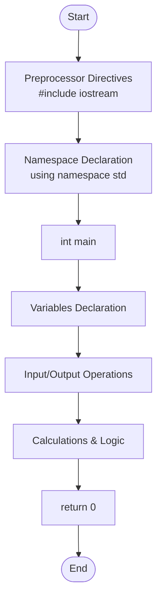
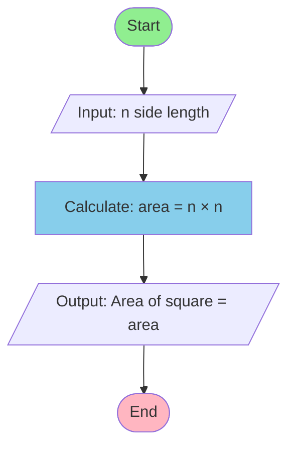
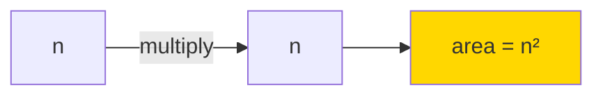
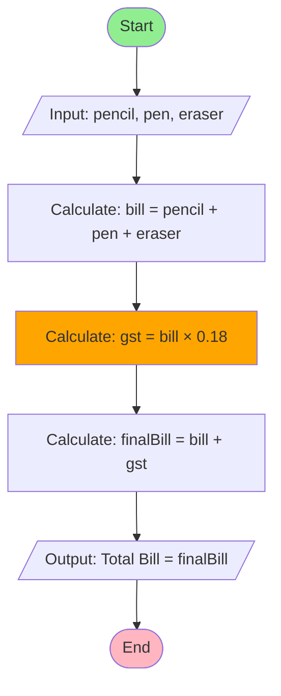
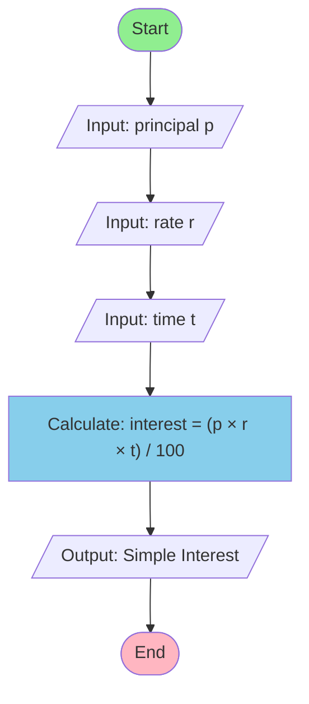
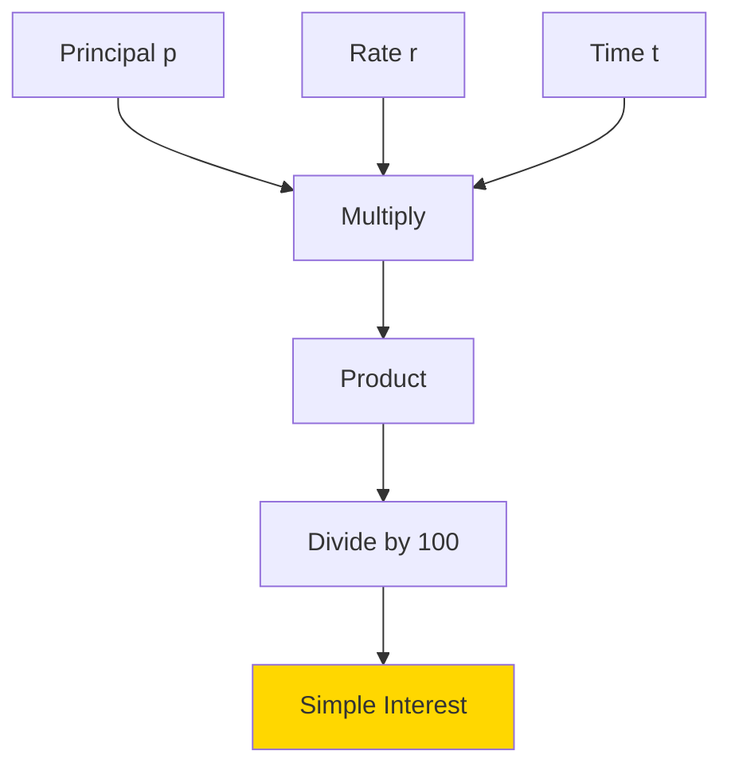
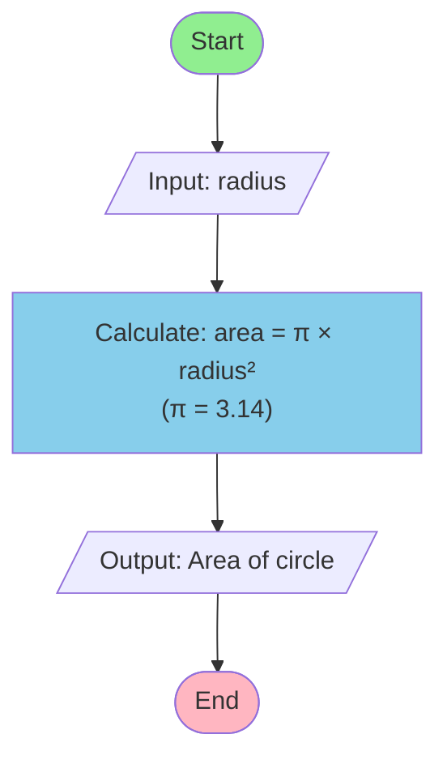
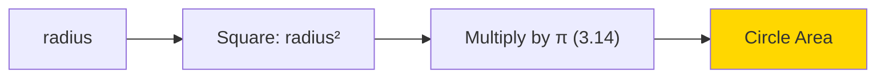
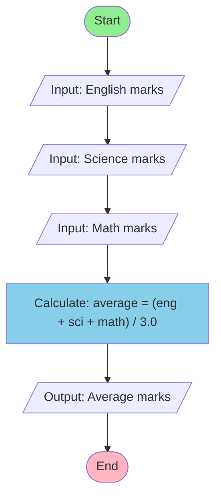

# Day 01+02: C++ Basics Visualization

This file provides visual representations using Mermaid diagrams to help understand the concepts and code flow in `cppBasics.cpp`.

## 1. Basic Program Structure

## 2. Area of a Square Calculation

**Formula Visualization:**

## 3. Total Bill with GST Calculation

## 4. Simple Interest Calculator

**Formula Breakdown:**

## 5. Area of a Circle Calculation

**Visual Representation:**

## 6. Average Marks Calculator

