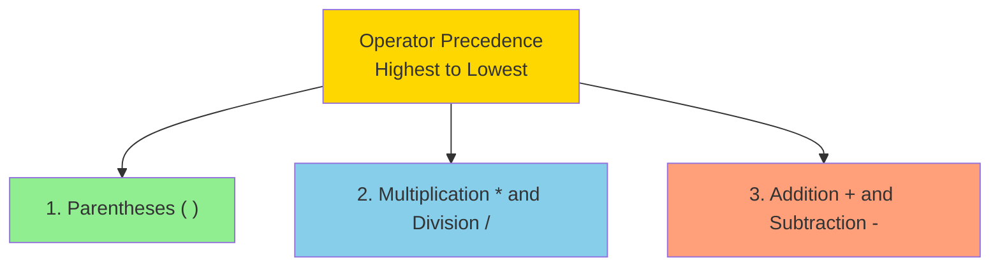
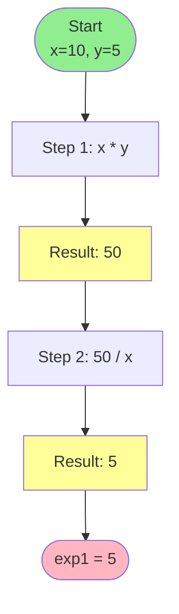
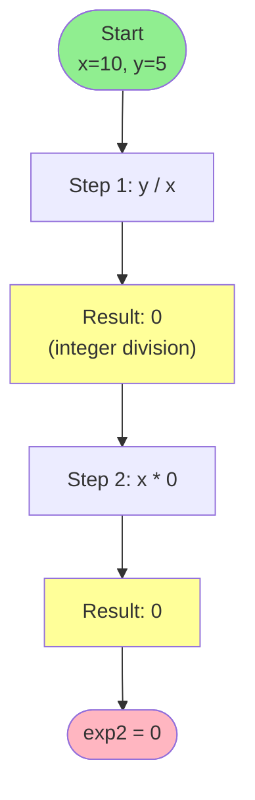
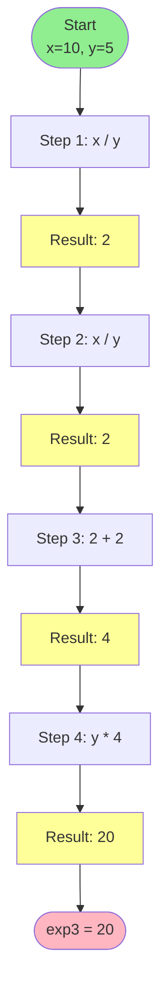
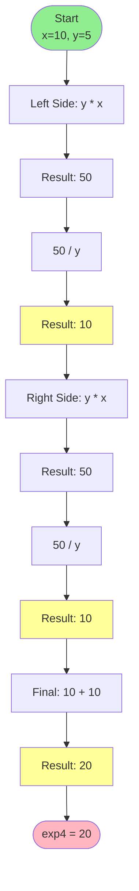

# Day 03: Operators Visualization

This file provides visual representations using Mermaid diagrams for understanding operator precedence and expressions in `operators.cpp`.

## 1. Operator Precedence Hierarchy



## 2. Expression 1: exp1 = (x * y / x)



**Expression Tree:**

```mermaid
graph TD
    A[/] --> B[*]
    A --> C[x=10]
    B --> D[x=10]
    B --> E[y=5]
    
    F[Evaluation] --> G["x * y = 50"]
    G --> H["50 / x = 5"]
    
    style A fill:#87CEEB
    style B fill:#87CEEB
```

## 3. Expression 2: exp2 = (x * (y / x))



**Expression Tree:**

```mermaid
graph TD
    A[*] --> B[x=10]
    A --> C[/]
    C --> D[y=5]
    C --> E[x=10]
    
    F[Evaluation] --> G["y / x = 0"]
    G --> H["x * 0 = 0"]
    
    style A fill:#87CEEB
    style C fill:#87CEEB
```

## 4. Expression 3: exp3 = (y * (x / y + x / y))



**Expression Tree:**

```mermaid
graph TD
    A[*] --> B[y=5]
    A --> C[+]
    C --> D[/]
    C --> E[/]
    D --> F[x=10]
    D --> G[y=5]
    E --> H[x=10]
    E --> I[y=5]
    
    style A fill:#87CEEB
    style C fill:#FFA07A
    style D fill:#87CEEB
    style E fill:#87CEEB
```

## 5. Expression 4: exp4 = (y * x / y + y * x / y)



**Expression Tree:**

```mermaid
graph TD
    A[+] --> B[/]
    A --> C[/]
    B --> D[*]
    B --> E[y=5]
    C --> F[*]
    C --> G[y=5]
    D --> H[y=5]
    D --> I[x=10]
    F --> J[y=5]
    F --> K[x=10]
    
    style A fill:#FFA07A
    style B fill:#87CEEB
    style C fill:#87CEEB
    style D fill:#87CEEB
    style F fill:#87CEEB
```

## Operator Precedence Summary

```mermaid
graph LR
    A[Expression] --> B{Has Parentheses?}
    B -->|Yes| C[Evaluate Innermost ( )]
    B -->|No| D{Has * or /?}
    C --> D
    D -->|Yes| E[Evaluate * or / left to right]
    D -->|No| F{Has + or -?}
    E --> F
    F -->|Yes| G[Evaluate + or - left to right]
    F -->|No| H[Done]
    G --> H
    
    style A fill:#FFD700
    style H fill:#90EE90
```
