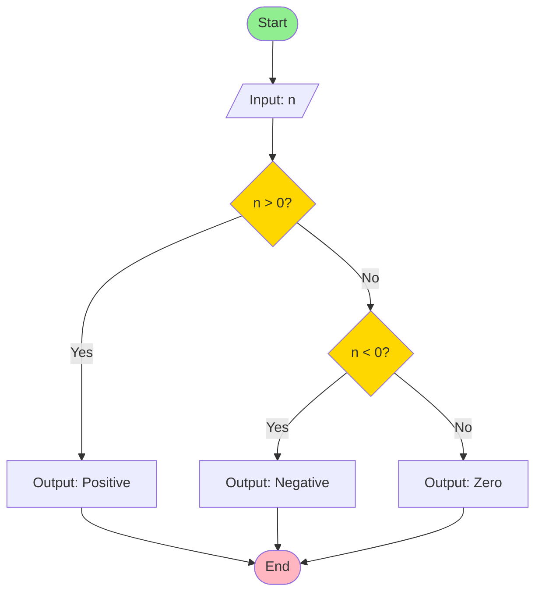
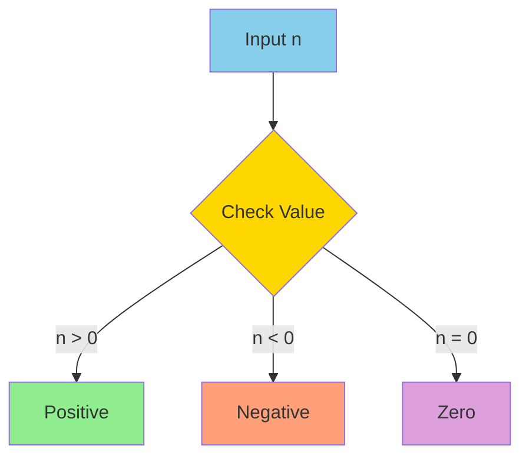
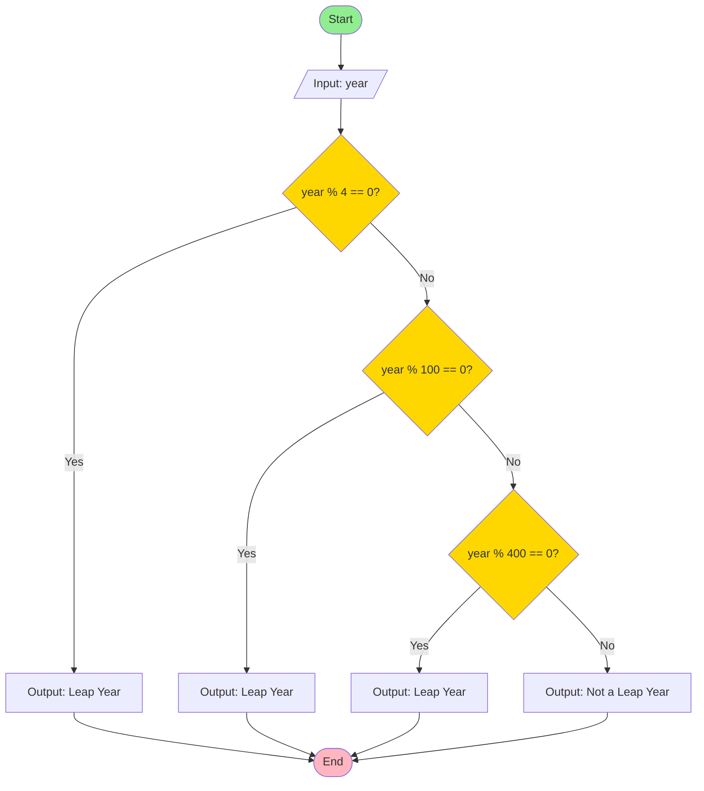
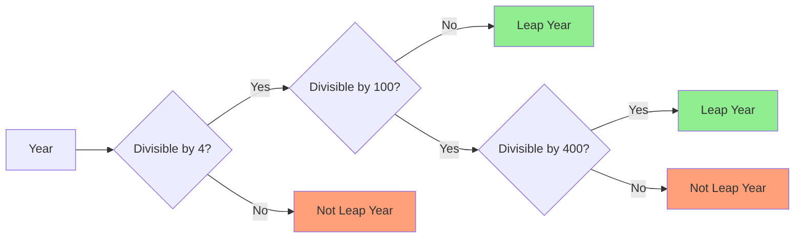
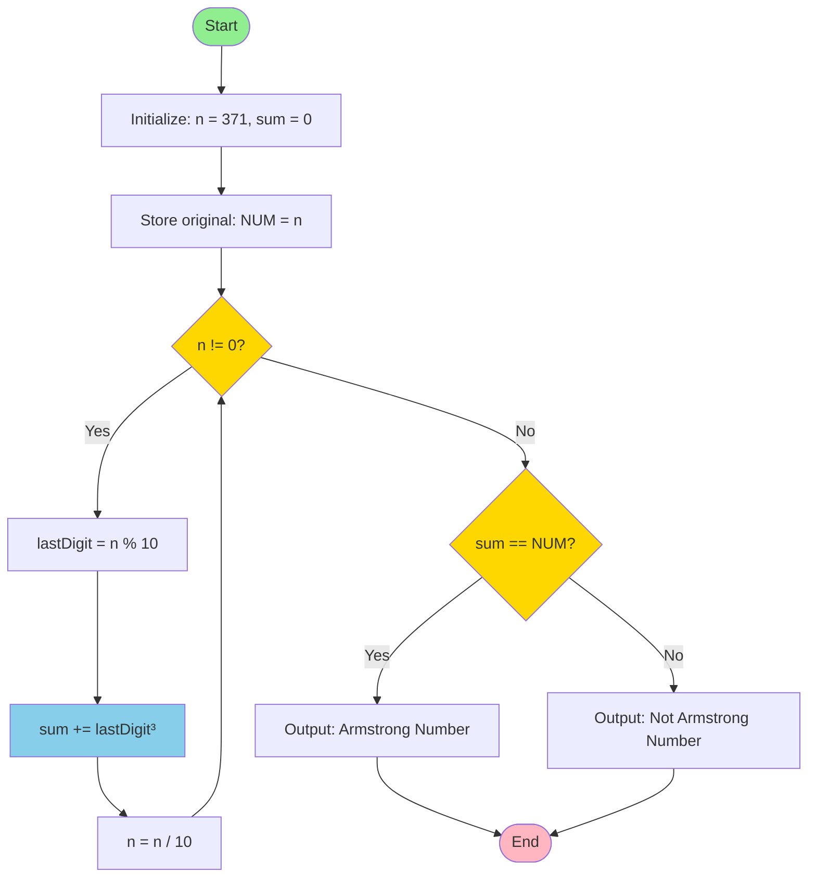
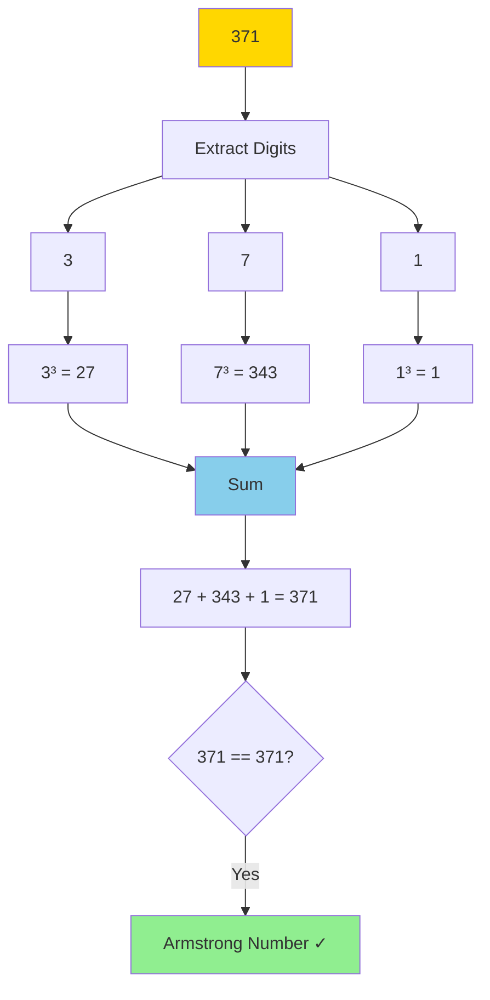
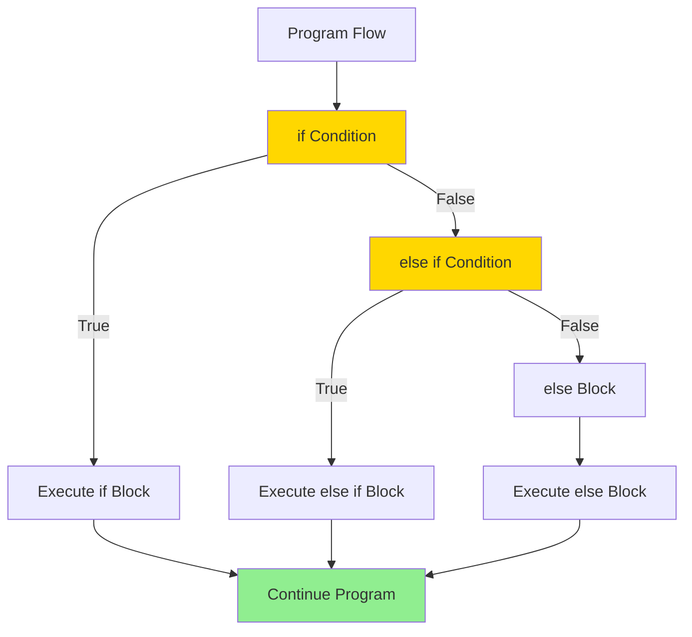
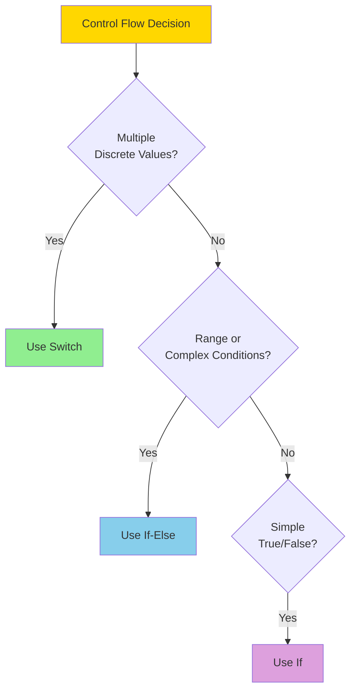
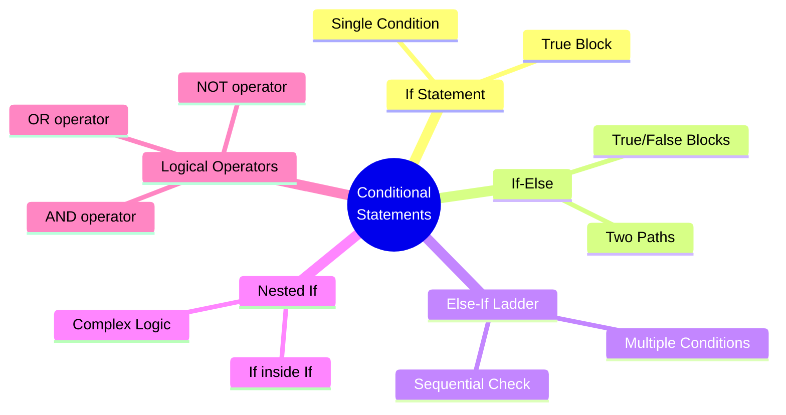

# Day 04: Conditional Statements Visualization

This file provides visual representations using Mermaid diagrams for understanding conditional statements in `Conditional_Statements.cpp`.

## 1. Positive/Negative/Zero Check



**Decision Tree:**



## 2. Leap Year Logic



**Leap Year Conditions:**



## 3. Armstrong Number Check

An Armstrong number is a number that equals the sum of its digits raised to the power of the number of digits.



**Armstrong Number Example (371):**



**Step-by-Step Breakdown:**

```mermaid
sequenceDiagram
    participant N as Number (371)
    participant LD as Last Digit
    participant S as Sum
    participant Loop as While Loop
    
    Note over N,S: Initialize: n=371, sum=0
    
    Loop->>N: Check n != 0?
    N-->>Loop: Yes (371)
    Loop->>LD: Extract: 371 % 10 = 1
    LD->>S: Add: sum + 1³ = 1
    Loop->>N: Update: 371 / 10 = 37
    
    Loop->>N: Check n != 0?
    N-->>Loop: Yes (37)
    Loop->>LD: Extract: 37 % 10 = 7
    LD->>S: Add: sum + 7³ = 344
    Loop->>N: Update: 37 / 10 = 3
    
    Loop->>N: Check n != 0?
    N-->>Loop: Yes (3)
    Loop->>LD: Extract: 3 % 10 = 3
    LD->>S: Add: sum + 3³ = 371
    Loop->>N: Update: 3 / 10 = 0
    
    Loop->>N: Check n != 0?
    N-->>Loop: No (0)
    Note over S: Final sum = 371
    Note over S: 371 == 371 ✓ Armstrong!
```

## 4. If-Else Statement Structure



## 5. Switch vs If-Else Comparison



## Key Concepts Summary


