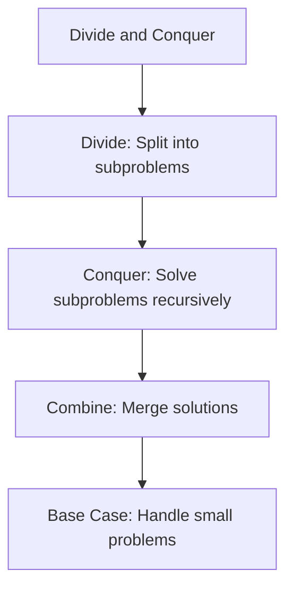

# Day 21: Divide and Conquer - Diagrams

## 1. Merge Sort Flowchart

This diagram shows the recursive flow for merge sort.

```mermaid
graph TD
    A[mergeSort(si, ei)] --> B{si >= ei?}
    B -->|Yes| C[Return]
    B -->|No| D[mid = si + (ei - si)/2]
    D --> E[mergeSort(si, mid)]
    E --> F[mergeSort(mid + 1, ei)]
    F --> G[merge(si, mid, ei)]
```

## 2. Quick Sort Flowchart

This diagram illustrates the quick sort process.

```mermaid
graph TD
    A[quickSort(si, ei)] --> B{si >= ei?}
    B -->|Yes| C[Return]
    B -->|No| D[pivotIdx = partition(si, ei)]
    D --> E[quickSort(si, pivotIdx - 1)]
    E --> F[quickSort(pivotIdx + 1, ei)]
```

## 3. Partition Algorithm Flowchart

This shows the partition step in quick sort.

```mermaid
graph TD
    A[partition(si, ei)] --> B[i = si - 1]
    B --> C[pivot = arr[ei]]
    C --> D[Loop j from si to ei-1]
    D --> E{arr[j] <= pivot?}
    E -->|Yes| F[i++, swap(arr[i], arr[j])]
    E -->|No| G[Continue]
    F --> H[After loop, i++, swap(arr[i], arr[ei])]
    H --> I[Return i]
```

## 4. Search in Rotated Sorted Array Flowchart

This diagram depicts the modified binary search for rotated arrays.

```mermaid
graph TD
    A[search(si, ei, target)] --> B{si > ei?}
    B -->|Yes| C[Return -1]
    B -->|No| D[mid = si + (ei - si)/2]
    D --> E{arr[mid] == target?}
    E -->|Yes| F[Return mid]
    E -->|No| G{arr[si] <= arr[mid]?}
    G -->|Yes| H{arr[si] <= target && target <= arr[mid]?}
    H -->|Yes| I[search(si, mid-1, target)]
    H -->|No| J[search(mid+1, ei, target)]
    G -->|No| K{arr[mid] <= target && target <= arr[ei]?}
    K -->|Yes| L[search(mid+1, ei, target)]
    K -->|No| M[search(si, mid-1, target)]
```

## 5. Divide and Conquer Pattern

General pattern for divide and conquer algorithms.



## Notes

- These diagrams use Mermaid syntax for GitHub compatibility.
- Flowcharts help visualize the recursive structure and decision points.
- For merge sort, note the merge step combines sorted halves.
- For quick sort, the partition step is crucial for efficiency.
- For rotated search, the key is identifying the sorted half.
