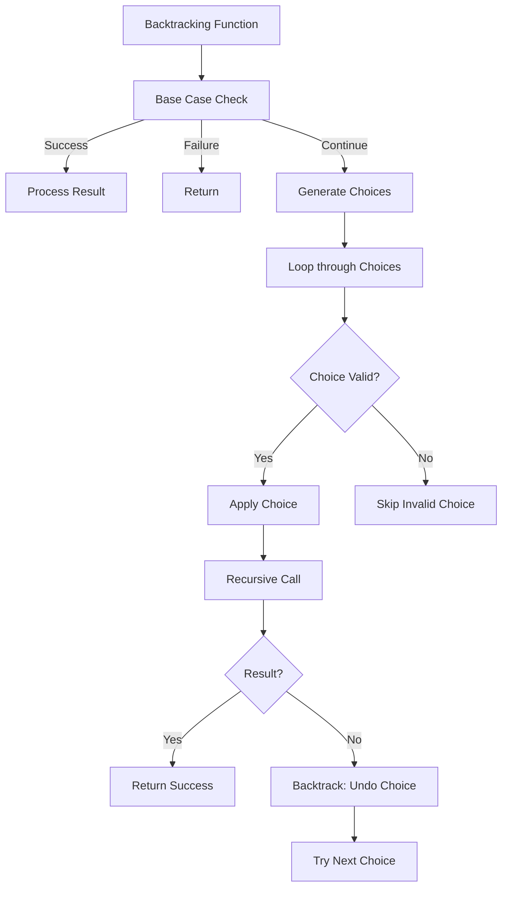

# Day 24: Backtracking - Diagrams

## 1. Subset Generation Flowchart

This diagram shows the backtracking process for generating subsets.

```mermaid
graph TD
    A[printSubsets(str, subset)] --> B{str.size() == 0?}
    B -->|Yes| C[Print subset]
    B -->|No| D[Include ch: printSubsets(str.substr(1), subset + ch)]
    D --> E[Exclude ch: printSubsets(str.substr(1), subset)]
```

## 2. Permutations Flowchart

This illustrates generating permutations using backtracking.

```mermaid
graph TD
    A[permutations(str, ans)] --> B{str.size() == 0?}
    B -->|Yes| C[Print ans]
    B -->|No| D[Loop i=0 to str.size()-1]
    D --> E[Choose ch = str[i]]
    E --> F[nextStr = str without i]
    F --> G[permutations(nextStr, ans + ch)]
    G --> H[Backtrack: next choice]
```

## 3. N-Queens Flowchart

This shows the backtracking for the N-Queens problem.

```mermaid
graph TD
    A[nQueens(row)] --> B{row == n?}
    B -->|Yes| C[Print board, count++]
    B -->|No| D[Loop j=0 to n-1]
    D --> E{isSafe(row, j)?}
    E -->|Yes| F[board[row][j] = 'Q']
    F --> G[nQueens(row+1)]
    G --> H[board[row][j] = '.']
    E -->|No| I[Continue loop]
```

## 4. Grid Ways Flowchart

This depicts counting paths in a grid.

```mermaid
graph TD
    A[gridWays(r, c, n, m, ans)] --> B{r == n-1 && c == m-1?}
    B -->|Yes| C[Print ans, return 1]
    B -->|No| D{r >= n or c >= m?}
    D -->|Yes| E[Return 0]
    D -->|No| F[val1 = gridWays(r, c+1, n, m, ans + 'R')]
    F --> G[val2 = gridWays(r+1, c, n, m, ans + 'D')]
    G --> H[Return val1 + val2]
```

## 5. Sudoku Solver Flowchart

This shows the backtracking for Sudoku.

```mermaid
graph TD
    A[sudokuSolver(row, col)] --> B{row == 9?}
    B -->|Yes| C[Print sudoku, return true]
    B -->|No| D{sudoku[row][col] != 0?}
    D -->|Yes| E[Move to next cell]
    D -->|No| F[Loop digit=1 to 9]
    F --> G{isItSafe(row, col, digit)?}
    G -->|Yes| H[sudoku[row][col] = digit]
    H --> I[sudokuSolver(nextRow, nextCol)]
    I --> J{solution found?}
    J -->|Yes| K[Return true]
    J -->|No| L[sudoku[row][col] = 0]
    G -->|No| M[Try next digit]
```

## 6. General Backtracking Pattern

This is the general pattern for backtracking algorithms.



## Notes

- These diagrams use Mermaid syntax for GitHub compatibility.
- Flowcharts visualize the decision-making and backtracking steps.
- For subset and permutations, note the include/exclude or choose patterns.
- For N-Queens and Sudoku, constraint checking is key.
- Use these to understand how backtracking explores the solution space.
