# Day 25: Linked List Visual Diagrams

## 1. Singly Linked List Structure

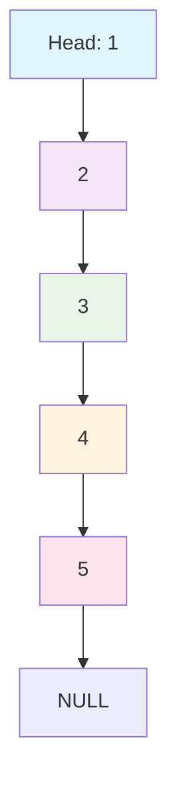

### Description

- Each node contains data and a pointer to the next node
- Last node points to NULL
- Head pointer points to the first node

## 2. Linked List Operations

### 2.1 Push Front (Insert at Beginning)

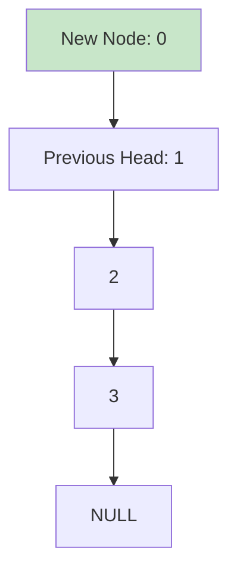

**Before:** 1 → 2 → 3 → NULL
**After:** 0 → 1 → 2 → 3 → NULL

### 2.2 Push Back (Insert at End)

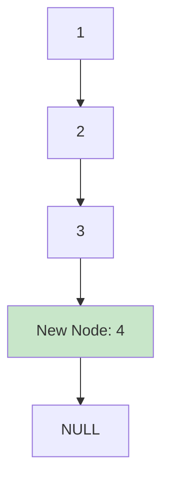

**Before:** 1 → 2 → 3 → NULL
**After:** 1 → 2 → 3 → 4 → NULL

### 2.3 Insert at Position (Position 3)

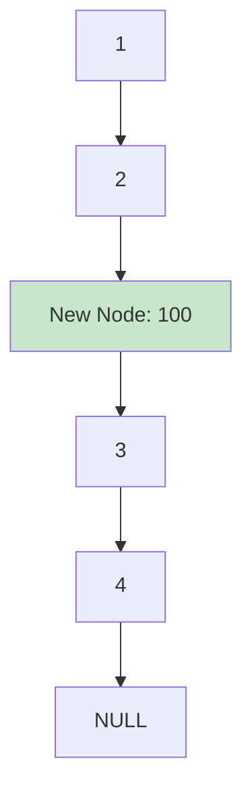

**Before:** 1 → 2 → 3 → 4 → NULL
**After:** 1 → 2 → 100 → 3 → 4 → NULL

## 3. Linked List Deletion Operations

### 3.1 Pop Front (Delete from Beginning)

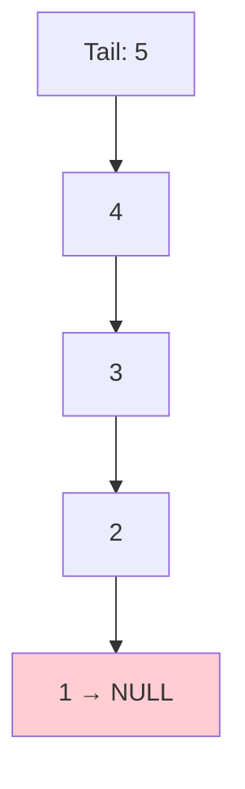

**Before:** 1 → 2 → 3 → 4 → 5 → NULL
**After:** 2 → 3 → 4 → 5 → NULL

### 3.2 Pop Back (Delete from End)

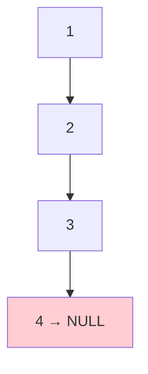

**Before:** 1 → 2 → 3 → 4 → 5 → NULL
**After:** 1 → 2 → 3 → 4 → NULL

## 4. Linked List Reversal

### Before Reversal


### After Reversal


## 5. Linked List vs Array Comparison

| Feature                | Linked List         | Array  |
| ---------------------- | ------------------- | ------ |
| **Memory Allocation**  | Dynamic             | Static |
| **Insertion/Deletion** | O(1) at ends        | O(n)   |
| **Random Access**      | O(n)                | O(1)   |
| **Memory Overhead**    | High (next pointer) | Low    |
| **Cache Friendly**     | No                  | Yes    |

## 6. Memory Layout

### Linked List in Memory

```
Memory Address: 1000    2000    3000    4000
Node 1: [Data: 1] -> [Next: 2000]
Node 2: [Data: 2] -> [Next: 3000]
Node 3: [Data: 3] -> [Next: 4000]
Node 4: [Data: 4] -> [Next: NULL]
```

### Array in Memory

```
Memory Address: 1000    1004    1008    1012    1016
Array: [1] [2] [3] [4] [5]
```

## 7. Common Linked List Patterns

### 7.1 Fast and Slow Pointers (Floyd's Algorithm)

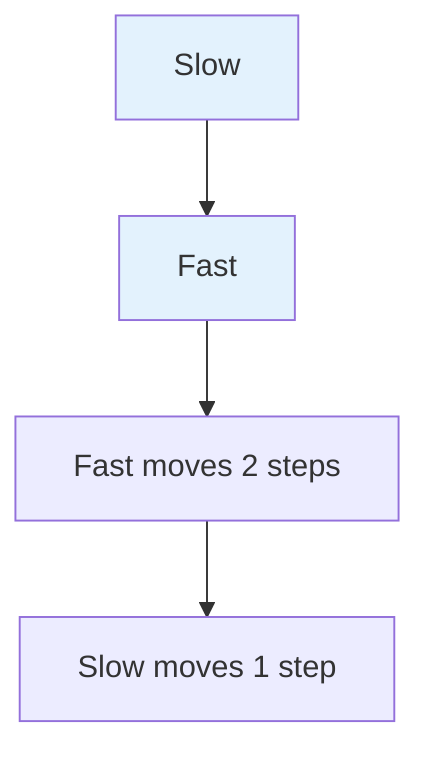

**Use Case:** Detect cycles, find middle element

### 7.2 Three Pointers (Reversal)

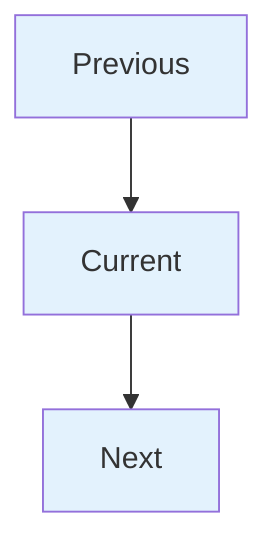

**Use Case:** Reverse linked list

## 8. Linked List Types

### 8.1 Singly Linked List

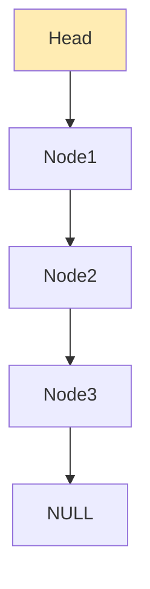

### 8.2 Doubly Linked List

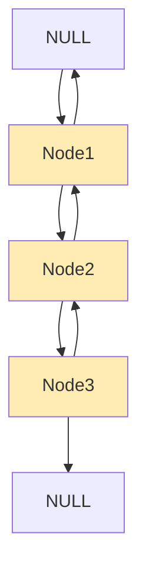

### 8.3 Circular Linked List

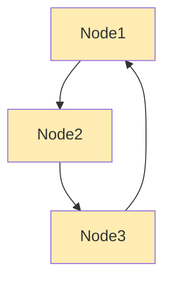

## 9. Time Complexity Comparison

| Operation           | Singly Linked List | Doubly Linked List | Array                   |
| ------------------- | ------------------ | ------------------ | ----------------------- |
| Access              | O(n)               | O(n)               | O(1)                    |
| Insert at Beginning | O(1)               | O(1)               | O(n)                    |
| Insert at End       | O(n)               | O(1)               | O(1) if capacity allows |
| Delete at Beginning | O(1)               | O(1)               | O(n)                    |
| Delete at End       | O(n)               | O(1)               | O(1)                    |
| Search              | O(n)               | O(n)               | O(n)                    |

## 10. When to Use Linked List

### ✅ Good Choice

- Dynamic size requirements
- Frequent insertions/deletions at beginning
- Memory efficient for variable sizes
- Implementing stacks and queues

### ❌ Avoid When

- Random access needed frequently
- Memory overhead is a concern
- Cache performance is critical
- Simple sequential access is sufficient (use array/vector)
