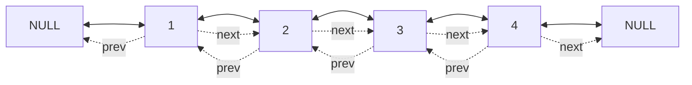
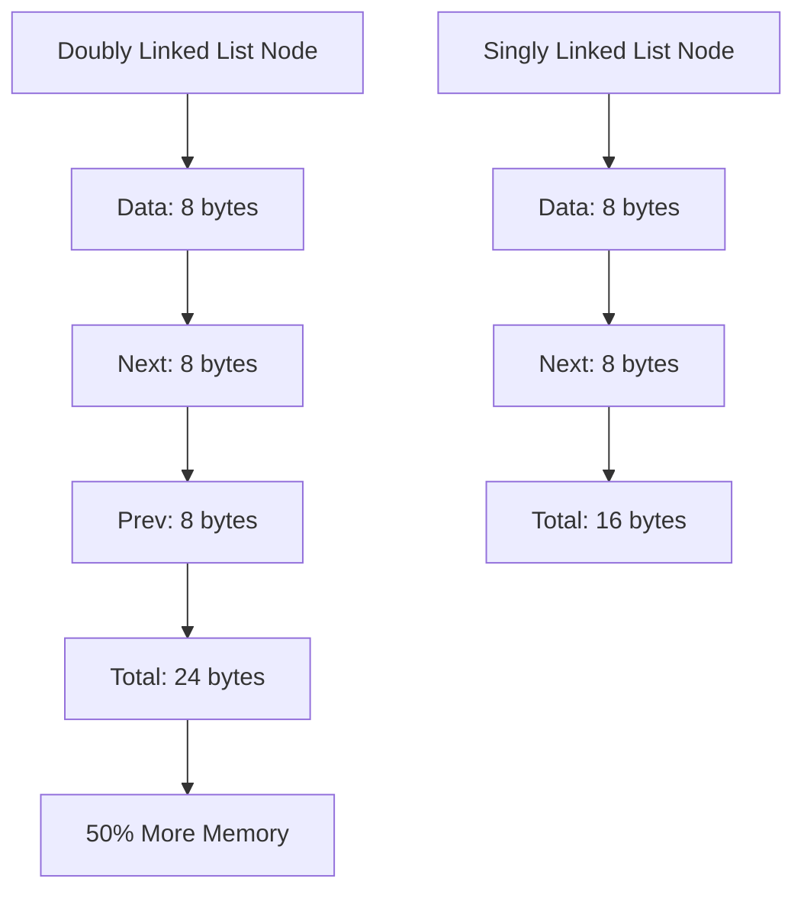

# Day 26: Doubly Linked Lists - Diagrams

## 1. Doubly Linked List Structure

This diagram shows the basic structure of a doubly linked list.



## 2. Push Front Flowchart

This shows the process of adding an element at the front.

```mermaid
graph TD
    A[push_front(val)] --> B[Create newNode]
    B --> C{head == NULL?}
    C -->|Yes| D[head = tail = newNode]
    C -->|No| E[newNode->next = head]
    E --> F[head->prev = newNode]
    F --> G[head = newNode]
```

## 3. Push Back Flowchart

This illustrates adding an element at the back.

```mermaid
graph TD
    A[push_back(val)] --> B[Create newNode]
    B --> C{head == NULL?}
    C -->|Yes| D[head = tail = newNode]
    C -->|No| E[newNode->prev = tail]
    E --> F[tail->next = newNode]
    F --> G[tail = newNode]
```

## 4. Pop Front Flowchart

This depicts removing an element from the front.

```mermaid
graph TD
    A[pop_front()] --> B{head == NULL?}
    B -->|Yes| C[Return]
    B -->|No| D[temp = head]
    D --> E[head = head->next]
    E --> F{head != NULL?}
    F -->|Yes| G[head->prev = NULL]
    F -->|No| H[tail = NULL]
    G --> I[temp->next = NULL]
    I --> J[delete temp]
```

## 5. Pop Back Flowchart

This shows removing an element from the back.

```mermaid
graph TD
    A[pop_back()] --> B{head == NULL?}
    B -->|Yes| C[Return]
    B -->|No| D[temp = tail->prev]
    D --> E[temp->next = NULL]
    E --> F[delete tail]
    F --> G[tail = temp]
    G --> H{tail == NULL?}
    H -->|Yes| I[head = NULL]
```

## 6. Insert at Position Flowchart

This illustrates inserting at a specific position.

```mermaid
graph TD
    A[insert(val, pos)] --> B{pos == 0?}
    B -->|Yes| C[push_front(val)]
    B -->|No| D[Traverse to pos-1]
    D --> E[Create newNode]
    E --> F[newNode->next = temp->next]
    F --> G[newNode->prev = temp]
    G --> H{temp->next != NULL?}
    H -->|Yes| I[temp->next->prev = newNode]
    H -->|No| J[tail = newNode]
    I --> K[temp->next = newNode]
```

## 7. Comparison with Singly Linked List

This compares memory usage.



## Notes

- These diagrams use Mermaid syntax for GitHub compatibility.
- The structure diagram shows bidirectional links.
- Flowcharts detail pointer updates for each operation.
- Comparison highlights memory trade-offs.
- Use these to visualize how pointers change during operations.
