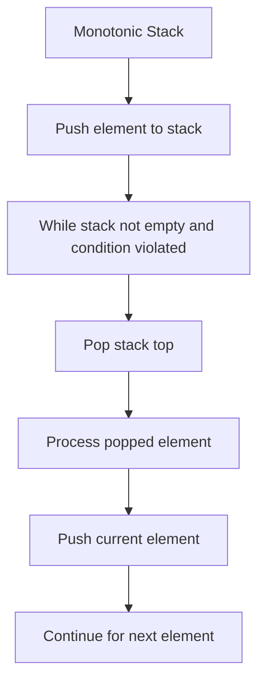

# Day 28: Advanced Stack Problems - Diagrams

## 1. Next Greater Element Flowchart

This shows the algorithm for finding the next greater element.

```mermaid
graph TD
    A[nextGreater] --> B[Initialize stack, ans[n-1] = -1, s.push(arr[n-1])]
    B --> C[Loop idx = n-2 to 0]
    C --> D[While !s.empty() and s.top() <= arr[idx]]
    D --> E[s.pop()]
    E --> F{s.empty()?}
    F -->|Yes| G[ans[idx] = -1]
    F -->|No| H[ans[idx] = s.top()]
    G --> I[s.push(arr[idx])]
    H --> I
```

## 2. Valid Parentheses Flowchart

This illustrates checking valid parentheses.

```mermaid
graph TD
    A[isValidParenthesis] --> B[Create stack s]
    B --> C[Loop through each char]
    C --> D{char is opening?}
    D -->|Yes| E[s.push(char)]
    D -->|No| F{s.empty()?}
    F -->|Yes| G[Return false]
    F -->|No| H{top matches char?}
    H -->|Yes| I[s.pop()]
    H -->|No| J[Return false]
    I --> K[After loop, return s.empty()]
    J --> K
```

## 3. Duplicate Parentheses Flowchart

This depicts detecting duplicate parentheses.

```mermaid
graph TD
    A[isDuplicateParenthesis] --> B[Create stack s]
    B --> C[Loop through each char]
    C --> D{char != ')'?}
    D -->|Yes| E[s.push(char)]
    D -->|No| F{s.top() == '('?}
    F -->|Yes| G[Return true]
    F -->|No| H[While s.top() != '(']
    H --> I[s.pop()]
    I --> J[s.pop()]
    J --> K[Continue loop]
```

## 4. Largest Rectangle in Histogram Flowchart

This shows the process for calculating the largest rectangle area.

```mermaid
graph TD
    A[maxAreaHistogram] --> B[Calculate NSL (Next Smaller Left)]
    B --> C[Calculate NSR (Next Smaller Right)]
    C --> D[Loop i=0 to n-1]
    D --> E[height = height[i]]
    E --> F[width = nsr[i] - nsl[i] - 1]
    F --> G[area = height * width]
    G --> H[maxArea = max(area, maxArea)]
    H --> I[Return maxArea]
```

## 5. Next Smaller Element Flowchart

This illustrates finding the next smaller element.

```mermaid
graph TD
    A[nextSmaller] --> B[Initialize stack, ans[n-1] = -1, s.push(arr[n-1])]
    B --> C[Loop idx = n-2 to 0]
    C --> D[While !s.empty() and s.top() >= arr[idx]]
    D --> E[s.pop()]
    E --> F{s.empty()?}
    F -->|Yes| G[ans[idx] = -1]
    F -->|No| H[ans[idx] = s.top()]
    G --> I[s.push(arr[idx])]
    H --> I
```

## 6. Monotonic Stack Pattern

This shows the general pattern for monotonic stacks.



## Notes

- These diagrams use Mermaid syntax for GitHub compatibility.
- Flowcharts visualize the stack operations for each problem.
- For next greater/smaller, note the monotonic stack usage.
- For parentheses, the matching logic is key.
- For histogram, boundary calculation is crucial.
- Use these to understand advanced stack problem patterns.
