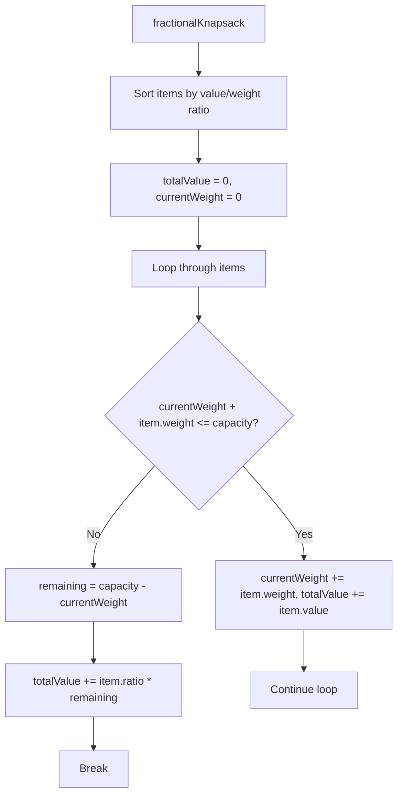
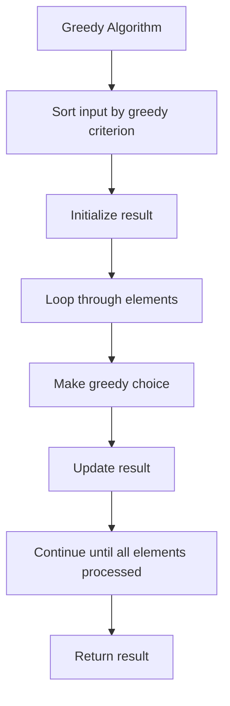

# Day 30: Greedy Algorithms - Diagrams

## 1. Activity Selection Flowchart

This shows the greedy approach for activity selection.

```mermaid
graph TD
    A[activitySelection] --> B[Sort activities by finish time]
    B --> C[count = 1, lastFinish = activities[0].second]
    C --> D[Loop i=1 to n-1]
    D --> E{activities[i].first >= lastFinish?}
    E -->|Yes| F[count++, lastFinish = activities[i].second]
    E -->|No| G[Continue loop]
    F --> H[Return count]
```

## 2. Fractional Knapsack Flowchart

This illustrates the greedy method for fractional knapsack.



## 3. Huffman Coding Flowchart

This depicts building the Huffman tree.

```mermaid
graph TD
    A[huffmanCoding] --> B[Create priority queue with leaf nodes]
    B --> C[While pq.size() > 1]
    C --> D[left = pq.top(), pq.pop()]
    D --> E[right = pq.top(), pq.pop()]
    E --> F[internal = new Node('$', left.freq + right.freq)]
    F --> G[internal.left = left, internal.right = right]
    G --> H[pq.push(internal)]
    H --> I[Print codes from root]
```

## 4. Job Sequencing Flowchart

This shows scheduling jobs for maximum profit.

```mermaid
graph TD
    A[jobSequencing] --> B[Sort jobs by profit descending]
    B --> C[Find maxDeadline]
    C --> D[Create schedule array of size maxDeadline+1]
    D --> E[Loop through jobs]
    E --> F[Find empty slot before deadline]
    F --> G{schedule[j] == -1?}
    G -->|Yes| H[schedule[j] = job.id, add to result]
    G -->|No| I[Try earlier slot]
    H --> J[Continue for next job]
```

## 5. Kruskal's Algorithm Flowchart

This illustrates finding MST using Kruskal's.

```mermaid
graph TD
    A[kruskalMST] --> B[Sort edges by weight]
    B --> C[Initialize parent and rank arrays]
    C --> D[mstWeight = 0, edgesUsed = 0]
    D --> E[Loop through edges]
    E --> F{findParent(u) != findParent(v)?}
    F -->|Yes| G[unionSets(u, v), mstWeight += w, edgesUsed++]
    F -->|No| H[Skip edge]
    G --> I{edgesUsed == vertices-1?}
    I -->|Yes| J[Break]
    I -->|No| K[Continue]
    H --> L[Continue]
```

## 6. Greedy Choice Property

This shows the general greedy algorithm pattern.



## Notes

- These diagrams use Mermaid syntax for GitHub compatibility.
- Flowcharts visualize the greedy decision-making process.
- For activity selection and knapsack, sorting is key.
- For Huffman, the priority queue builds the tree.
- For job sequencing and Kruskal, slot/edge selection is crucial.
- Use these to understand how greedy choices lead to optimal solutions.
