# Day 31: Binary Trees Visual Diagrams

## 1. Binary Tree Structure

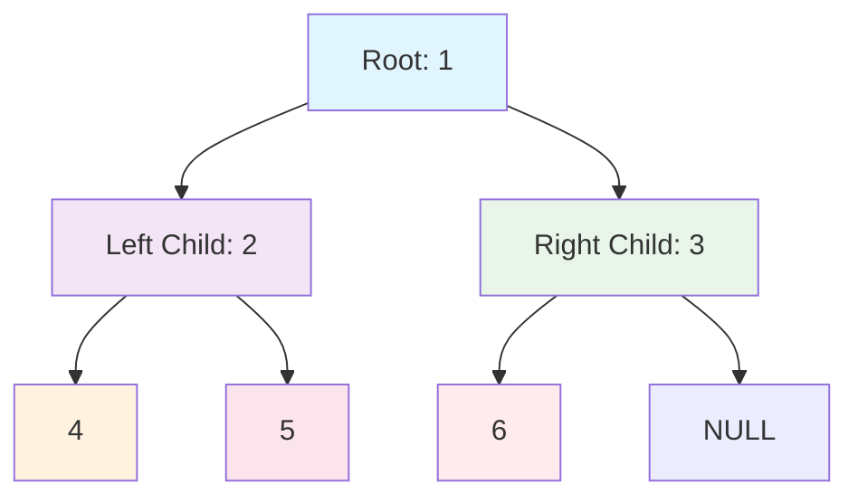

### Tree Representation

```
       1
      / \
     2   3
    / \   \
   4   5   6
```

## 2. Tree Traversal Orders

### 2.1 Preorder Traversal (Root → Left → Right)

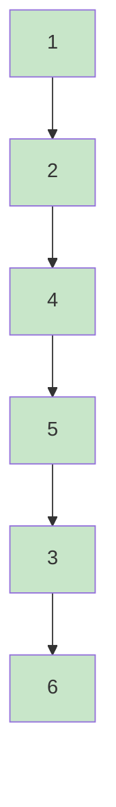

**Order:** 1 → 2 → 4 → 5 → 3 → 6

### 2.2 Inorder Traversal (Left → Root → Right)


**Order:** 4 → 2 → 5 → 1 → 3 → 6

### 2.3 Postorder Traversal (Left → Right → Root)


**Order:** 4 → 5 → 2 → 6 → 3 → 1

### 2.4 Level Order Traversal (BFS)

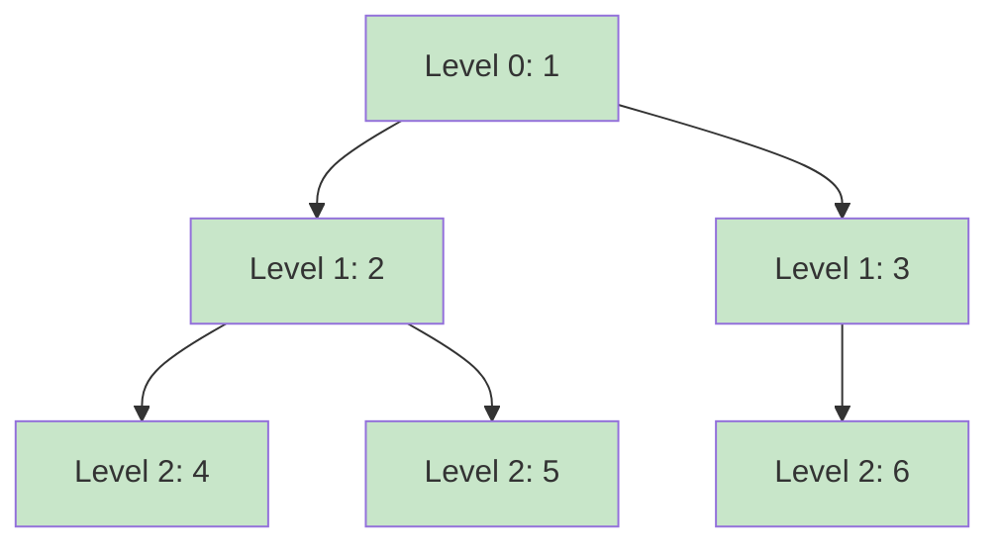

**Order:** 1 → 2 → 3 → 4 → 5 → 6

## 3. Binary Tree Types

### 3.1 Complete Binary Tree

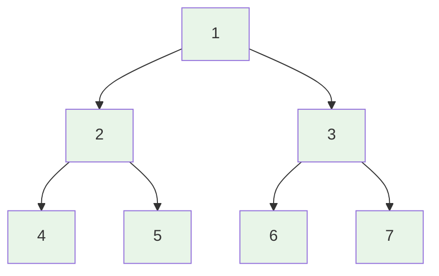

**Properties:** All levels filled except possibly the last, filled from left to right

### 3.2 Full Binary Tree

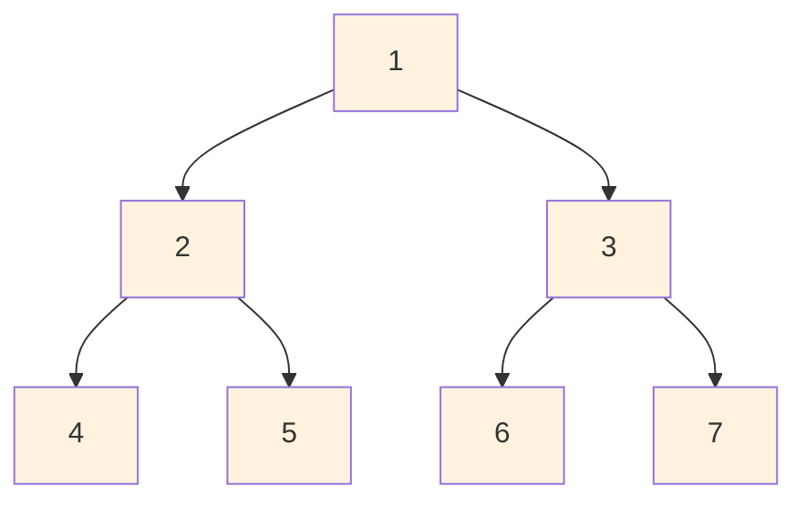

**Properties:** Every node has either 0 or 2 children

### 3.3 Perfect Binary Tree

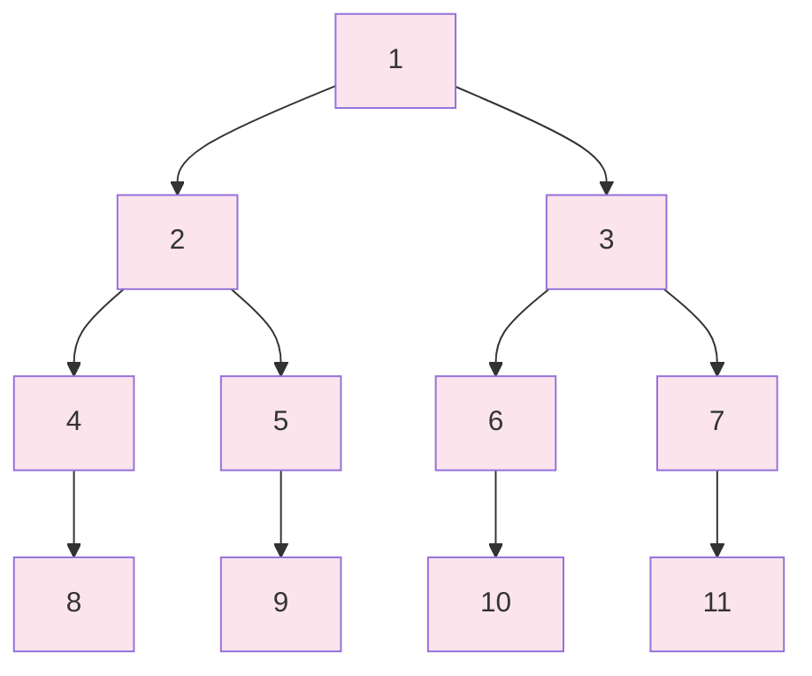

**Properties:** All levels completely filled

## 4. Tree Views

### 4.1 Left View

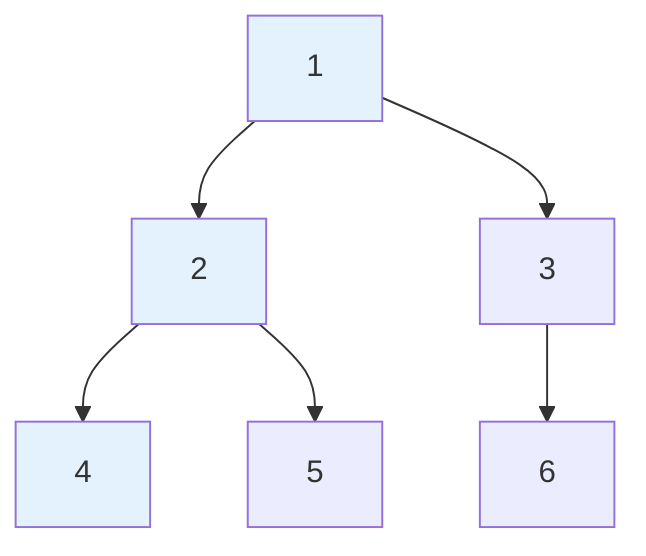

**Left View Nodes:** 1, 2, 4

### 4.2 Right View

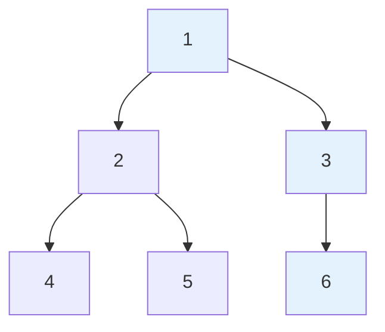

**Right View Nodes:** 1, 3, 6

### 4.3 Top View

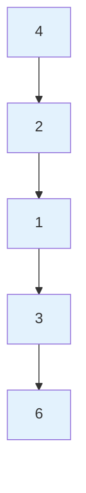

**Top View Nodes:** 4, 2, 1, 3, 6

## 5. Binary Search Tree (BST)

### 5.1 BST Structure

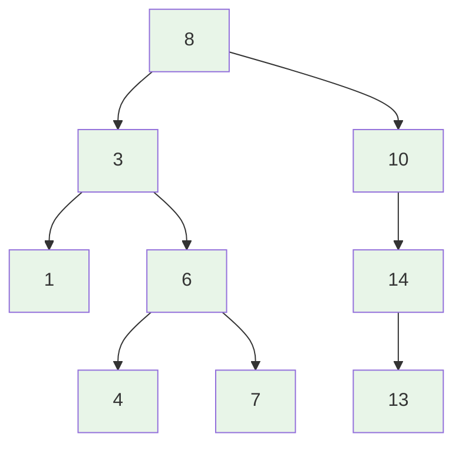

**BST Property:** Left child < Parent < Right child

### 5.2 BST Insertion

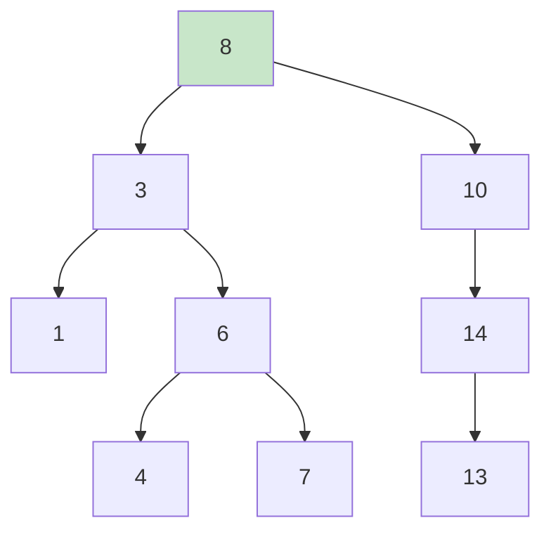

**Insert 9:** Goes to right of 8, left of 10

## 6. Tree Problems Visualization

### 6.1 Tree Diameter (Longest Path)

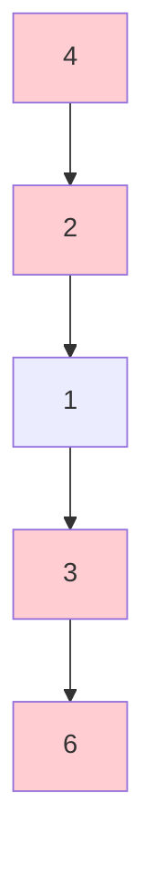

**Diameter Path:** 4 → 2 → 1 → 3 → 6 (Length: 4)

### 6.2 Lowest Common Ancestor

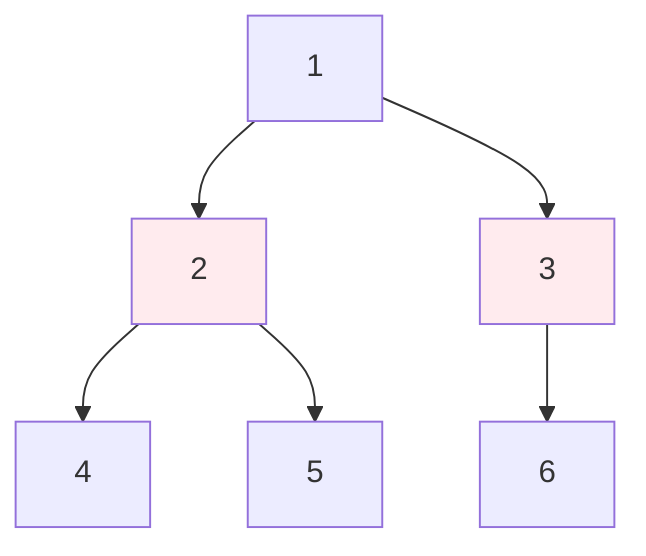

**LCA of 4 and 6:** Node 1
**LCA of 4 and 5:** Node 2

## 7. Tree Construction from Array

### Array: [1, 2, 4, -1, -1, 5, -1, -1, 3, -1, 6, -1, -1]

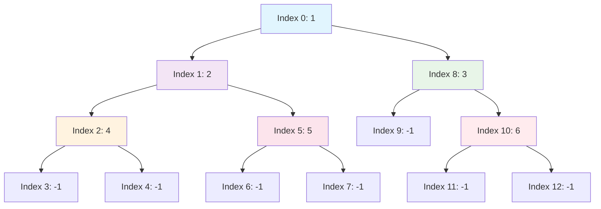

## 8. Tree Height Calculation

### Height Calculation Process

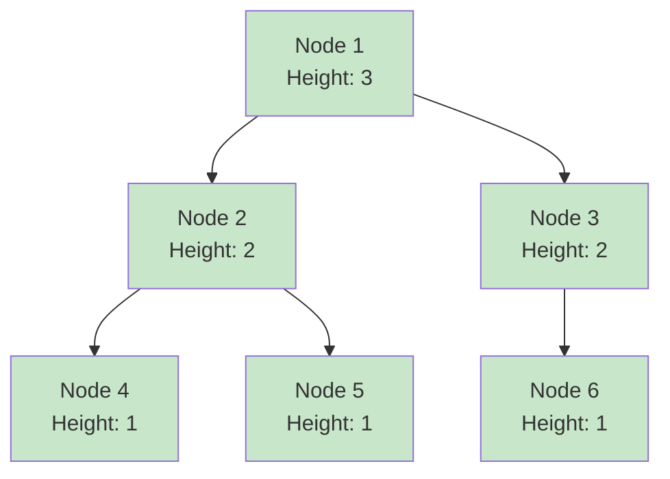

**Height Calculation:**

- Leaf nodes (4, 5, 6): Height = 1
- Node 2: max(1, 1) + 1 = 2
- Node 3: max(1, 0) + 1 = 2
- Node 1: max(2, 2) + 1 = 3

## 9. Binary Tree vs Other Structures

| Feature      | Binary Tree | BST      | Heap     |
| ------------ | ----------- | -------- | -------- |
| **Ordering** | No          | Yes      | Partial  |
| **Search**   | O(n)        | O(log n) | O(n)     |
| **Insert**   | O(n)        | O(log n) | O(log n) |
| **Delete**   | O(n)        | O(log n) | O(log n) |
| **Balanced** | No          | Can be   | Always   |

## 10. Tree Applications

### 10.1 File System

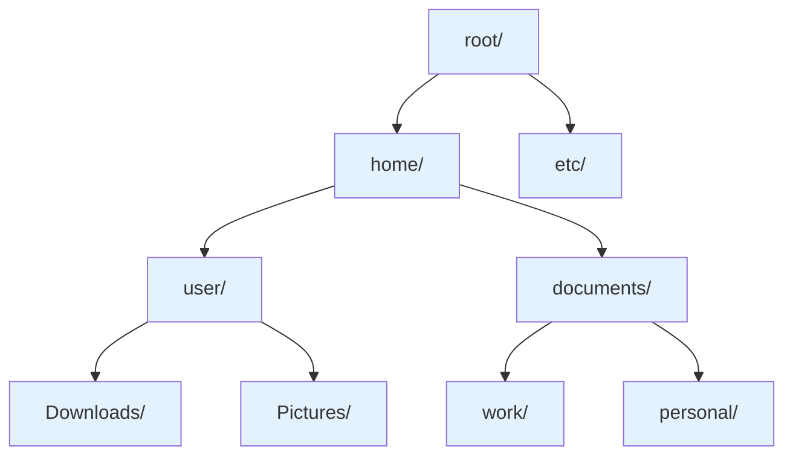

### 10.2 Expression Tree

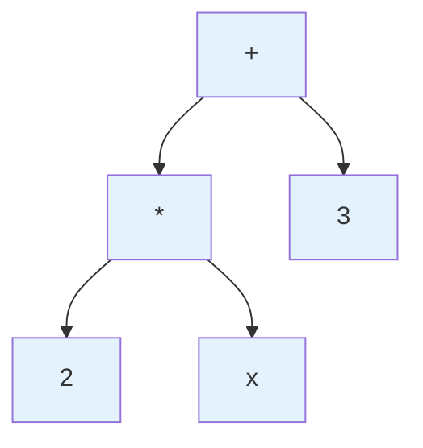

**Expression:** (2 \* x) + 3

## 11. Tree Memory Layout

### Contiguous Memory (Array)

```
Index:  0   1   2   3   4   5   6   7   8   9  10  11  12
Value: [1] [2] [4] [-1] [-1] [5] [-1] [-1] [3] [-1] [6] [-1] [-1]
```

### Linked Memory (Nodes)

```
Address: 1000      2000      3000      4000      5000
Node1: [1|2000,5000] -> Node2: [2|3000,4000] -> Node4: [4|NULL,NULL]
                     -> Node3: [3|NULL,6000] -> Node6: [6|NULL,NULL]
```

## 12. When to Use Binary Trees

### ✅ Good Choice

- Hierarchical data representation
- Fast search in BST
- Priority queue implementation (Heap)
- Expression evaluation
- Database indexing

### ❌ Avoid When

- Linear data access pattern
- Memory is severely constrained
- Simple key-value storage needed (use Hash Table)
- Random access is primary operation

## 13. Advanced Tree Concepts

### 13.1 AVL Tree (Self-Balancing)

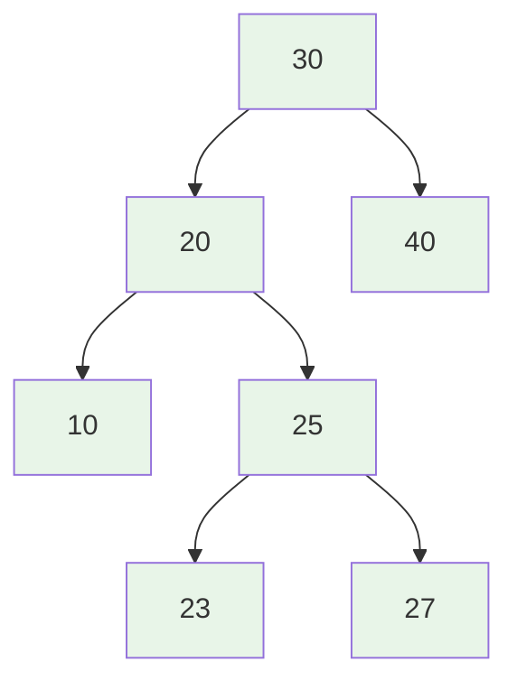

**Balance Factor:** Height(left) - Height(right) ∈ {-1, 0, 1}

### 13.2 Red-Black Tree

```mermaid
graph TD
    A[10<br/>Black] --> B[5<br/>Red]
    A --> C[15<br/>Red]
    B --> D[3<br/>Black]
    B --> E[7<br/>Black]
    C --> F[12<br/>Black]
    C --> G[17<br/>Black]

    style A fill:#ffebee
    style B fill:#ffcdd2
    style C fill:#ffcdd2
    style D fill:#ffebee
    style E fill:#ffebee
    style F fill:#ffebee
    style G fill:#ffebee
```

**Properties:** Root is black, red nodes have black children, equal black height
