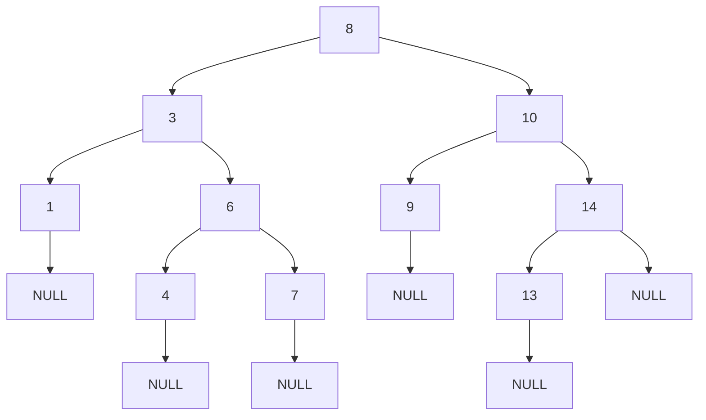

# Day 32: Binary Search Trees Part 1 - Diagrams

## 1. BST Structure

This shows the basic structure of a binary search tree.



## 2. BST Insertion Flowchart

This illustrates the process of inserting a node in BST.

```mermaid
graph TD
    A[insert(root, val)] --> B{root == NULL?}
    B -->|Yes| C[Return new Node(val)]
    B -->|No| D{val < root->data?}
    D -->|Yes| E[root->left = insert(root->left, val)]
    D -->|No| F[root->right = insert(root->right, val)]
    E --> G[Return root]
    F --> G
```

## 3. BST Search Flowchart

This depicts searching for a node in BST.

```mermaid
graph TD
    A[search(root, key)] --> B{root == NULL or root->data == key?}
    B -->|Yes| C[Return root]
    B -->|No| D{key < root->data?}
    D -->|Yes| E[Return search(root->left, key)]
    D -->|No| F[Return search(root->right, key)]
```

## 4. BST Deletion Flowchart

This shows the process of deleting a node in BST.

```mermaid
graph TD
    A[deleteNode(root, key)] --> B{root == NULL?}
    B -->|Yes| C[Return root]
    B -->|No| D{key < root->data?}
    D -->|Yes| E[root->left = deleteNode(root->left, key)]
    D -->|No| F{key > root->data?}
    F -->|Yes| G[root->right = deleteNode(root->right, key)]
    F -->|No| H[Handle deletion cases]
    H --> I{Leaf node?}
    I -->|Yes| J[Delete root, return NULL]
    I -->|No| K{One child?}
    K -->|Yes| L[Return child]
    K -->|No| M[Find successor, replace, delete successor]
    E --> N[Return root]
    G --> N
    J --> N
    L --> N
    M --> N
```

## 5. BST Validation Flowchart

This illustrates validating if a tree is a BST.

```mermaid
graph TD
    A[isValidBST(root, minVal, maxVal)] --> B{root == NULL?}
    B -->|Yes| C[Return true]
    B -->|No| D{root->data <= minVal or root->data >= maxVal?}
    D -->|Yes| E[Return false]
    D -->|No| F[Return isValidBST(root->left, minVal, root->data) and isValidBST(root->right, root->data, maxVal)]
```

## 6. Inorder Successor Flowchart

This shows finding the inorder successor.

```mermaid
graph TD
    A[inorderSuccessor(root, target)] --> B[Initialize successor = NULL]
    B --> C{root != NULL?}
    C -->|Yes| D{target->data < root->data?}
    D -->|Yes| E[successor = root, root = root->left]
    D -->|No| F[root = root->right]
    E --> G[Continue loop]
    F --> G
    C -->|No| H[Return successor]
```

## 7. Build BST from Sorted Array Flowchart

This depicts constructing BST from sorted array.

```mermaid
graph TD
    A[buildBST(start, end)] --> B{start > end?}
    B -->|Yes| C[Return NULL]
    B -->|No| D[mid = start + (end - start)/2]
    D --> E[root = new Node(arr[mid])]
    E --> F[root->left = buildBST(start, mid-1)]
    F --> G[root->right = buildBST(mid+1, end)]
    G --> H[Return root]
```

## Notes

- These diagrams use Mermaid syntax for GitHub compatibility.
- The structure diagram shows the BST property.
- Flowcharts detail the recursive nature of BST operations.
- For insertion and search, the decision points are key.
- For deletion, handle different cases carefully.
- Use these to visualize BST operations and properties.
