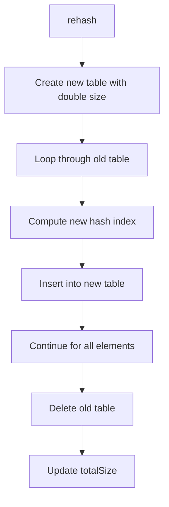

# Day 38: Hashing & Hash Tables - Diagrams

## 1. Hash Table Insert Flowchart

This shows inserting a key-value pair in a hash table.

```mermaid
graph TD
    A[insert(key, value)] --> B[Compute hash index]
    B --> C[Create new node with key, value]
    C --> D[Insert at beginning of chain]
    D --> E[Update currentSize]
    E --> F{Check load factor > 1?}
    F -->|Yes| G[Rehash()]
    F -->|No| H[Done]
```

## 2. Hash Table Search Flowchart

This illustrates searching for a key in a hash table.

```mermaid
graph TD
    A[search(key)] --> B[Compute hash index]
    B --> C[Traverse chain at index]
    C --> D{key found?}
    D -->|Yes| E[Return value]
    D -->|No| F[Continue traversal]
    F --> G{End of chain?}
    G -->|Yes| H[Return not found]
    G -->|No| I[Continue]
```

## 3. Two Sum Using Hashing Flowchart

This depicts solving two sum using unordered_map.

```mermaid
graph TD
    A[twoSum] --> B[Create unordered_map]
    B --> C[Loop through array]
    C --> D{map.count(target - arr[i])?}
    D -->|Yes| E[Return indices]
    D -->|No| F[map[arr[i]] = i]
    F --> G[Continue loop]
```

## 4. First Repeating Element Flowchart

This shows finding the first repeating element.

```mermaid
graph TD
    A[findFirstRepeating] --> B[Create unordered_map for indices]
    B --> C[Loop through array]
    C --> D{map.count(arr[i])?}
    D -->|Yes| E[Return arr[i]]
    D -->|No| F[map[arr[i]] = i]
    F --> G[Continue loop]
    G --> H[Return -1 if no repeat]
```

## 5. Count Distinct in Window Flowchart

This illustrates counting distinct elements in a sliding window.

```mermaid
graph TD
    A[countDistinctInWindow] --> B[Initialize unordered_map]
    B --> C[Add first k elements to map]
    C --> D[Print map.size()]
    D --> E[Loop i = k to n-1]
    E --> F[Remove arr[i-k] from map]
    F --> G[Add arr[i] to map]
    G --> H[Print map.size()]
    H --> I[Continue loop]
```

## 6. Hash Table vs BST Comparison

This compares hash table and BST.

```mermaid
graph TD
    A[Hash Table] --> B[O(1) avg insert/search/delete]
    B --> C[Unordered]
    C --> D[Collision handling]
    D --> E[O(n) worst case]
    F[BST (Map/Set)] --> G[O(log n) insert/search/delete]
    G --> H[Ordered]
    H --> I[No collisions]
    I --> J[Balanced for performance]
```

## 7. Rehashing Flowchart

This depicts the rehashing process.



## Notes

- These diagrams use Mermaid syntax for GitHub compatibility.
- Flowcharts visualize hash table operations and applications.
- For insert and search, chaining handles collisions.
- For two sum, the map stores complements.
- For sliding window, map tracks frequencies.
- Use these to understand hashing and hash table usage.
