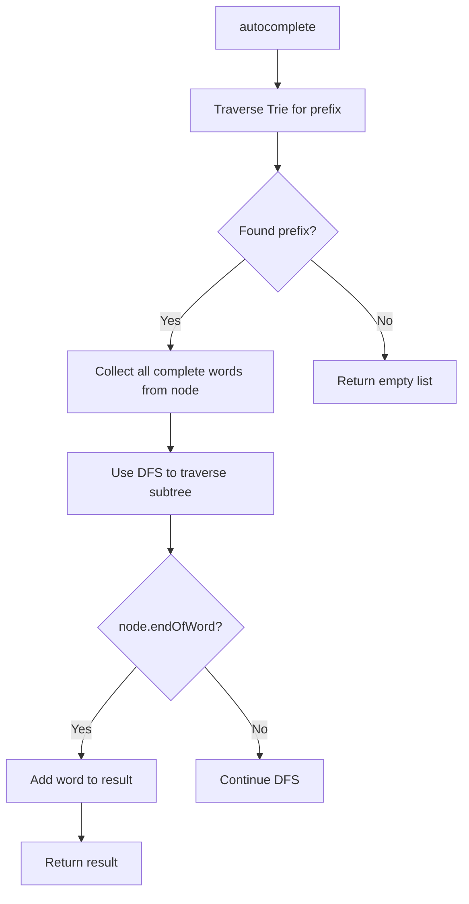
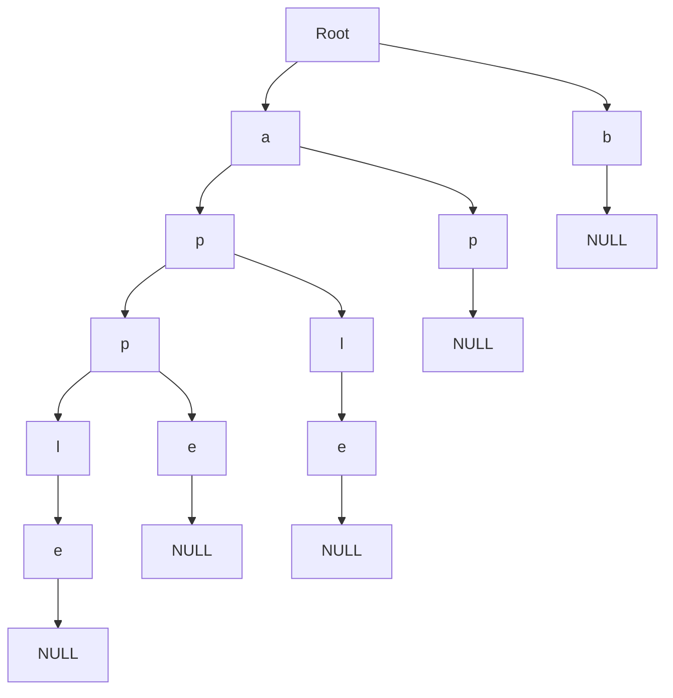

# Day 40: Trie Data Structure & String Problems - Diagrams

## 1. Trie Insert Flowchart

This shows inserting a word into the Trie.

```mermaid
graph TD
    A[insert(key)] --> B[Start from root]
    B --> C[Loop through each char in key]
    C --> D{children.count(char)?}
    D -->|Yes| E[temp = children[char]]
    D -->|No| F[children[char] = new Node(), temp = children[char]]
    E --> G[temp.freq++]
    F --> G
    G --> H{Last char?}
    H -->|Yes| I[temp.endOfWord = true]
    H -->|No| J[Continue loop]
```

## 2. Trie Search Flowchart

This illustrates searching for a word in the Trie.

```mermaid
graph TD
    A[search(key)] --> B[Start from root]
    B --> C[Loop through each char in key]
    C --> D{children.count(char)?}
    D -->|Yes| E[temp = children[char]]
    D -->|No| F[Return false]
    E --> G{Last char?}
    G -->|Yes| H{temp.endOfWord?}
    H -->|Yes| I[Return true]
    H -->|No| J[Return false]
    G -->|No| K[Continue loop]
```

## 3. Word Break Flowchart

This depicts solving the word break problem.

```mermaid
graph TD
    A[wordBreakFunc] --> B{key.size() == 0?}
    B -->|Yes| C[Return true]
    B -->|No| D[Loop i=0 to key.size()-1]
    D --> E[first = key.substr(0, i+1)]
    E --> F[second = key.substr(i+1)]
    F --> G{search(first) and wordBreakFunc(second)?}
    G -->|Yes| H[Return true]
    G -->|No| I[Continue loop]
    I --> J[Return false]
```

## 4. Shortest Unique Prefix Flowchart

This shows finding the shortest unique prefix.

```mermaid
graph TD
    A[getPrefix] --> B[Start from root, prefix = ""]
    B --> C[Loop through each char in key]
    C --> D[prefix += char]
    D --> E{temp.children[char].freq == 1?}
    E -->|Yes| F[Return prefix]
    E -->|No| G[temp = temp.children[char]]
    G --> H[Continue loop]
```

## 5. Longest String with All Prefixes Flowchart

This illustrates finding the longest string with all prefixes.

```mermaid
graph TD
    A[longestHelper] --> B[Loop through children]
    B --> C{child.second.endOfWord?}
    C -->|Yes| D[temp += child.first]
    D --> E{temp.size() > ans.size() or (equal and temp < ans)?}
    E -->|Yes| F[ans = temp]
    E -->|No| G[longestHelper(child.second, ans, temp)]
    G --> H[temp = temp.substr(0, temp.size()-1)]
    H --> I[Continue loop]
```

## 6. Autocomplete Flowchart

This depicts implementing autocomplete.



## 7. Trie Structure

This shows the basic Trie structure.



## Notes

- These diagrams use Mermaid syntax for GitHub compatibility.
- Flowcharts visualize Trie operations and string problems.
- For insert and search, traversing the tree is key.
- For word break, recursion checks prefixes.
- For unique prefix, frequency tracking is crucial.
- Use these to understand Trie-based algorithms.
