# Day 41: Graphs Visual Diagrams

## 1. Graph Representation

### 1.1 Adjacency List Representation

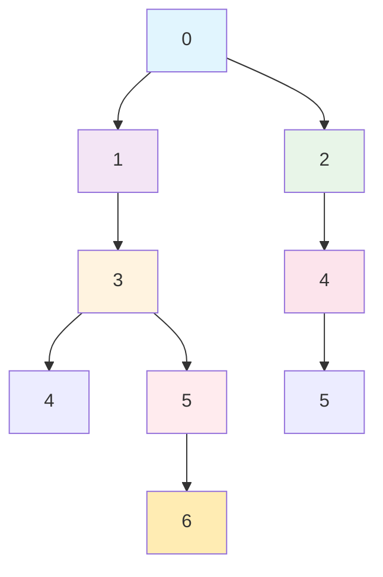

**Adjacency List:**

- 0: [1, 2]
- 1: [0, 3]
- 2: [0, 4]
- 3: [1, 4, 5]
- 4: [2, 3, 5]
- 5: [3, 4, 6]
- 6: [5]

### 1.2 Adjacency Matrix Representation

```
    0  1  2  3  4  5  6
  +---------------------
0 | 0  1  1  0  0  0  0
1 | 1  0  0  1  0  0  0
2 | 1  0  0  0  1  0  0
3 | 0  1  0  0  1  1  0
4 | 0  0  1  1  0  1  0
5 | 0  0  0  1  1  0  1
6 | 0  0  0  0  0  1  0
```

## 2. Graph Traversal Algorithms

### 2.1 Breadth-First Search (BFS)

```mermaid
graph TD
    A[Start: 0<br/>Queue: []<br/>Visited: [0]] --> B[Visit 1<br/>Queue: [2]<br/>Visited: [0,1]]
    B --> C[Visit 2<br/>Queue: [3,4]<br/>Visited: [0,1,2]]
    C --> D[Visit 3<br/>Queue: [4,4,5]<br/>Visited: [0,1,2,3]]
    D --> E[Visit 4<br/>Queue: [4,5,5]<br/>Visited: [0,1,2,3,4]]
    E --> F[Visit 5<br/>Queue: [4,5,6]<br/>Visited: [0,1,2,3,4,5]]
    F --> G[Visit 6<br/>Queue: [4,5]<br/>Visited: [0,1,2,3,4,5,6]]

    style A fill:#c8e6c9
    style B fill:#c8e6c9
    style C fill:#c8e6c9
    style D fill:#c8e6c9
    style E fill:#c8e6c9
    style F fill:#c8e6c9
    style G fill:#c8e6c9
```

**BFS Order:** 0 → 1 → 2 → 3 → 4 → 5 → 6

### 2.2 Depth-First Search (DFS)

```mermaid
graph TD
    A[Start: 0<br/>Stack: []<br/>Visited: [0]] --> B[Visit 1<br/>Stack: [2]<br/>Visited: [0,1]]
    B --> C[Visit 3<br/>Stack: [2,4]<br/>Visited: [0,1,3]]
    C --> D[Visit 4<br/>Stack: [2,4,5]<br/>Visited: [0,1,3,4]]
    D --> E[Visit 5<br/>Stack: [2,4,5,6]<br/>Visited: [0,1,3,4,5]]
    E --> F[Visit 6<br/>Stack: [2,4,5]<br/>Visited: [0,1,3,4,5,6]]
    F --> G[Backtrack to 5<br/>Stack: [2,4]<br/>Visited: [0,1,3,4,5,6]]
    G --> H[Backtrack to 4<br/>Stack: [2]<br/>Visited: [0,1,3,4,5,6]]
    H --> I[Backtrack to 2<br/>Stack: []<br/>Visited: [0,1,3,4,5,6]]

    style A fill:#c8e6c9
    style B fill:#c8e6c9
    style C fill:#c8e6c9
    style D fill:#c8e6c9
    style E fill:#c8e6c9
    style F fill:#c8e6c9
    style G fill:#c8e6c9
    style H fill:#c8e6c9
    style I fill:#c8e6c9
```

**DFS Order:** 0 → 1 → 3 → 4 → 5 → 6 → 2

## 3. Weighted Graph

### 3.1 Weighted Graph Structure

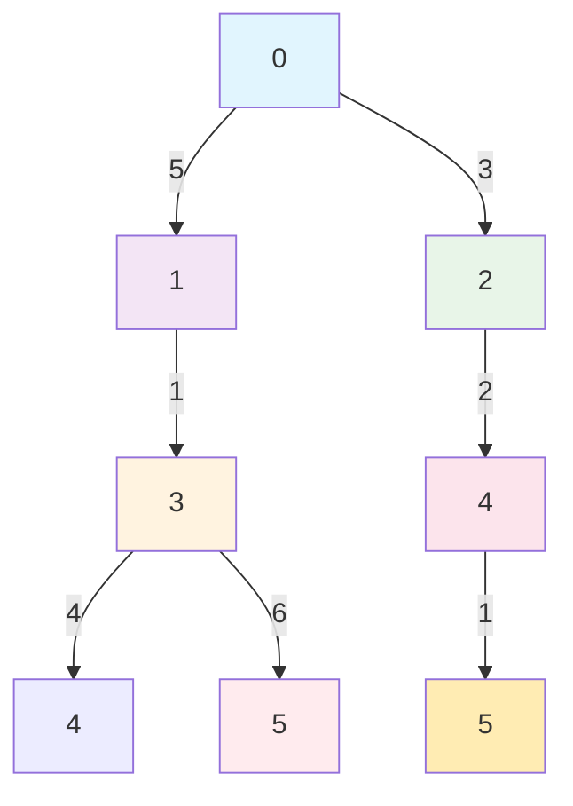

**Weighted Adjacency List:**

- 0: [(1,5), (2,3)]
- 1: [(0,5), (3,1)]
- 2: [(0,3), (4,2)]
- 3: [(1,1), (4,4), (5,6)]
- 4: [(2,2), (3,4), (5,1)]
- 5: [(3,6), (4,1)]

## 4. Graph Types

### 4.1 Undirected Graph

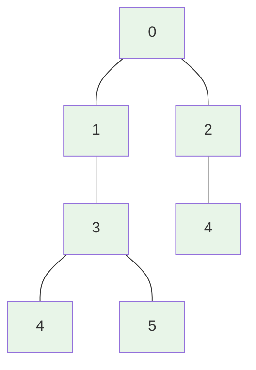

**Properties:** Bidirectional edges, no direction

### 4.2 Directed Graph (Digraph)

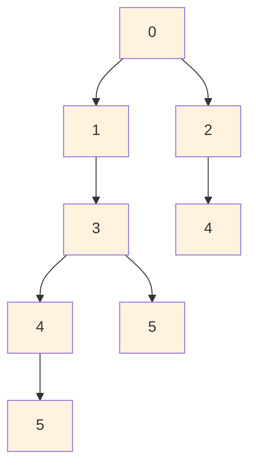

**Properties:** Unidirectional edges, direction matters

### 4.3 Cyclic Graph

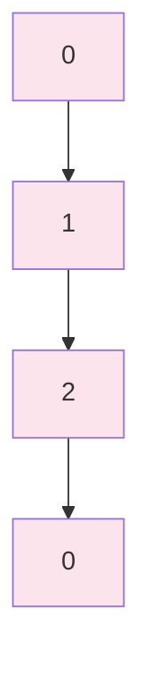

**Cycle:** 0 → 1 → 2 → 0

### 4.4 Acyclic Graph (DAG)

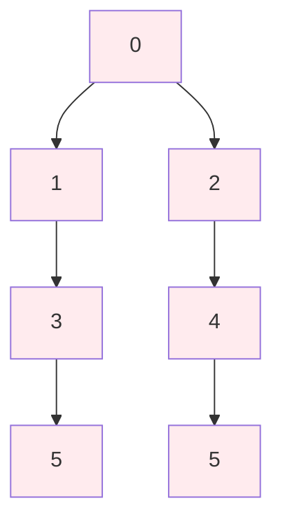

**Properties:** No cycles, topological ordering possible

## 5. Connected Components

### 5.1 Connected Graph

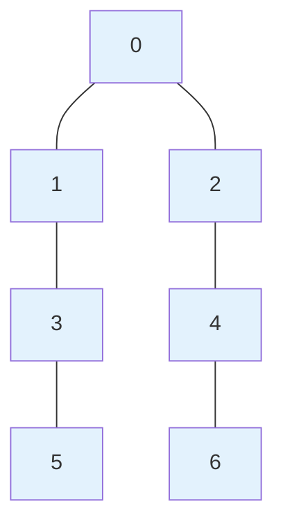

**Connected Components:** 1

### 5.2 Disconnected Graph

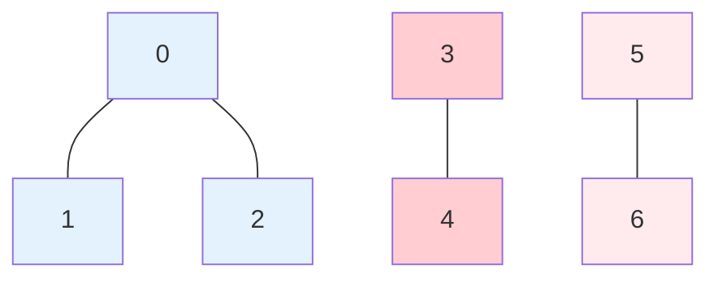

**Connected Components:** 3

## 6. Shortest Path Algorithms

### 6.1 BFS Shortest Path in Unweighted Graph

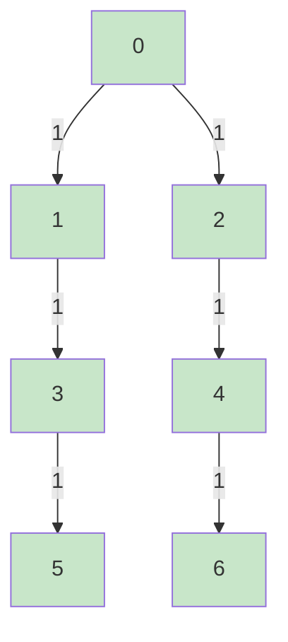

**Shortest Path from 0 to 6:** 0 → 2 → 4 → 6 (Distance: 3)

### 6.2 Dijkstra's Algorithm (Weighted)

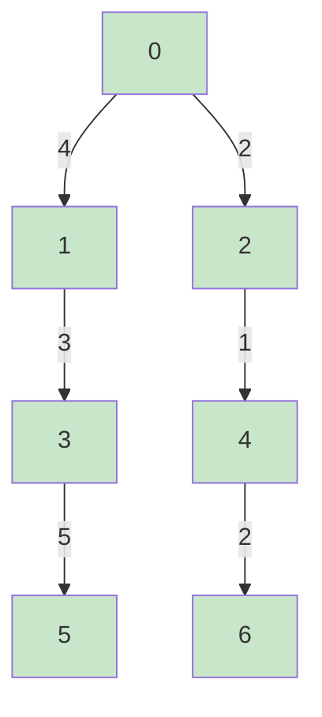

**Shortest Path from 0 to 6:** 0 → 2 → 4 → 6 (Distance: 5)

## 7. Minimum Spanning Tree (MST)

### 7.1 Kruskal's Algorithm

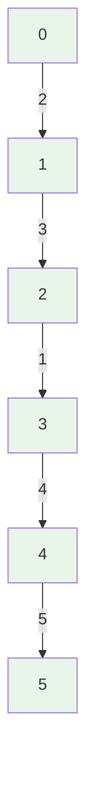

**MST Edges:** (0-1:2), (2-3:1), (3-4:4), (1-2:3), (4-5:5)
**Total Weight:** 15

### 7.2 Prim's Algorithm


**MST Construction Order:** 0 → 1 → 2 → 3 → 4 → 5

## 8. Graph Problems Visualization

### 8.1 Cycle Detection

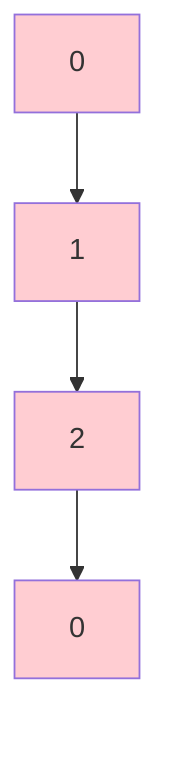

**Cycle Detected:** 0 → 1 → 2 → 0

### 8.2 Bipartite Graph (2-Colorable)

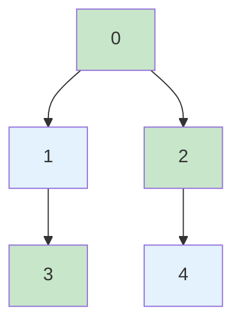

**Color Assignment:** 0:Red, 1:Blue, 2:Red, 3:Red, 4:Blue

### 8.3 Topological Sort (DAG)

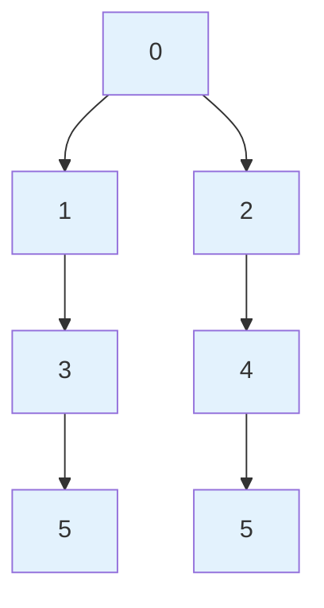

**Topological Order:** 0 → 1 → 2 → 3 → 4 → 5

## 9. Graph Memory Layout

### Adjacency List Memory

```
Vertex 0: [1, 2] -> Next: [0, 3] -> Next: [0, 4] -> Next: [1, 4, 5] -> ...
Vertex 1: [0, 3] -> Next: [2, 4] -> Next: [0, 4] -> Next: [2, 3, 5] -> ...
```

### Adjacency Matrix Memory

```
Row 0: [0, 1, 1, 0, 0, 0, 0]
Row 1: [1, 0, 0, 1, 0, 0, 0]
Row 2: [1, 0, 0, 0, 1, 0, 0]
Row 3: [0, 1, 0, 0, 1, 1, 0]
...
```

## 10. Graph Applications

### 10.1 Social Network

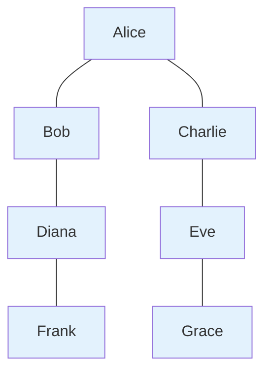

**Friendship Graph:** Nodes = People, Edges = Friendships

### 10.2 Computer Network

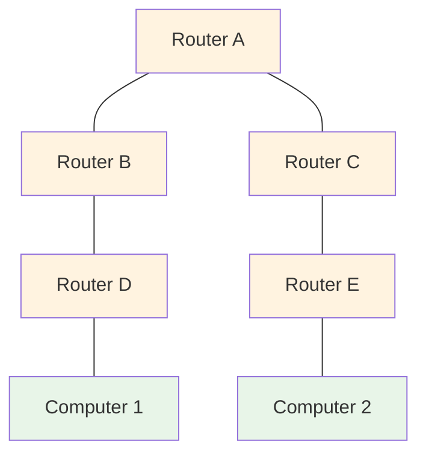

**Network Topology:** Routers connected in mesh

### 10.3 Dependency Graph

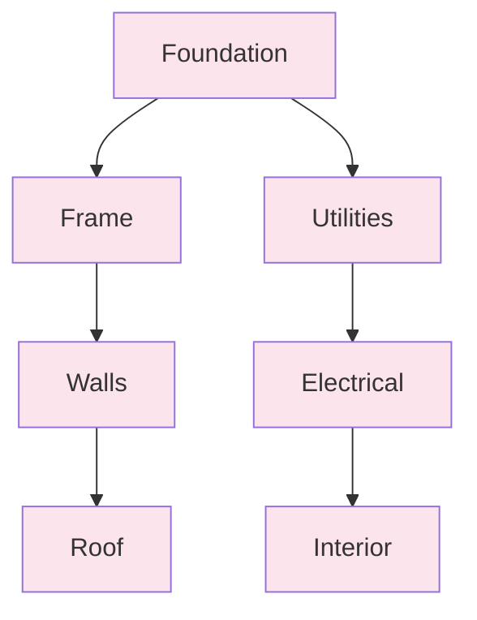

**Construction Dependencies:** Must follow topological order

## 11. Graph Algorithm Comparison

| Algorithm          | Time Complexity  | Space Complexity | Use Case                            |
| ------------------ | ---------------- | ---------------- | ----------------------------------- |
| **BFS**            | O(V + E)         | O(V)             | Shortest path in unweighted graph   |
| **DFS**            | O(V + E)         | O(V)             | Topological sort, cycle detection   |
| **Dijkstra**       | O((V + E) log V) | O(V)             | Shortest path in weighted graph     |
| **Bellman-Ford**   | O(V × E)         | O(V)             | Shortest path with negative weights |
| **Floyd-Warshall** | O(V³)            | O(V²)            | All pairs shortest paths            |
| **Kruskal**        | O(E log E)       | O(V + E)         | Minimum spanning tree               |
| **Prim**           | O((V + E) log V) | O(V)             | Minimum spanning tree               |

## 12. When to Use Graphs

### ✅ Good Choice

- Modeling relationships and connections
- Path finding and routing problems
- Network analysis and optimization
- Dependency management
- Social network analysis

### ❌ Avoid When

- Simple linear data processing
- Memory constraints are severe
- Hierarchical data (use trees)
- Key-value storage (use hash tables)

## 13. Advanced Graph Concepts

### 13.1 Strongly Connected Components

```mermaid
graph TD
    A[0] --> B[1]
    B --> C[2]
    C --> D[0]
    E[3] --> F[4]
    F --> G[5]
    G --> H[3]

    style A fill:#ffebee
    style B fill:#ffebee
    style C fill:#ffebee
    style D fill:#ffebee
    style E fill:#e8f5e8
    style F fill:#e8f5e8
    style G fill:#e8f5e8
    style H fill:#e8f5e8
```

**SCC 1:** {0, 1, 2}
**SCC 2:** {3, 4, 5}

### 13.2 Graph Coloring

```mermaid
graph TD
    A[0<br/>Red] --- B[1<br/>Blue]
    A --- C[2<br/>Blue]
    B --- D[3<br/>Red]
    C --- E[4<br/>Red]

    style A fill:#ffcdd2
    style B fill:#e3f2fd
    style C fill:#e3f2fd
    style D fill:#ffcdd2
    style E fill:#ffcdd2
```

**3-Colorable:** Red, Blue, Red

## 14. Interview Tips Visualization

### 14.1 Common Graph Patterns

```mermaid
graph TD
    A[Understand Problem] --> B[Identify Graph Type]
    B --> C[Choose Representation]
    C --> D[Select Algorithm]
    D --> E[Analyze Complexity]
    E --> F[Handle Edge Cases]

    style A fill:#c8e6c9
    style B fill:#c8e6c9
    style C fill:#c8e6c9
    style D fill:#c8e6c9
    style E fill:#c8e6c9
    style F fill:#c8e6c9
```

### 14.2 Edge Cases to Consider

```mermaid
graph TD
    A[Empty Graph<br/>V=0, E=0] --> B[Single Node<br/>V=1, E=0]
    A --> C[Two Nodes<br/>Connected/Disconnected]
    B --> D[Complete Graph<br/>All nodes connected]
    C --> E[Self Loops<br/>Node connected to itself]
    D --> F[Multiple Components<br/>Disconnected graph]

    style A fill:#ffebee
    style B fill:#ffebee
    style C fill:#ffebee
    style D fill:#ffebee
    style E fill:#ffebee
    style F fill:#ffebee
```

## 15. Performance Comparison

### Memory Usage

| Graph Type                 | Adjacency List | Adjacency Matrix |
| -------------------------- | -------------- | ---------------- |
| **Sparse Graph** (E << V²) | O(V + E)       | O(V²)            |
| **Dense Graph** (E ≈ V²)   | O(V + E)       | O(V²)            |
| **Space Efficient**        | ✅ Yes         | ❌ No            |

### Time Complexity

| Operation       | Adjacency List | Adjacency Matrix |
| --------------- | -------------- | ---------------- |
| **Add Edge**    | O(1)           | O(1)             |
| **Remove Edge** | O(degree)      | O(1)             |
| **Check Edge**  | O(degree)      | O(1)             |
| **Space**       | O(V + E)       | O(V²)            |

## 16. Real-World Applications

### 16.1 Google Maps Routing

```mermaid
graph TD
    A[Source] -->|10| B[City A]
    A -->|15| C[City B]
    B -->|5| D[City C]
    C -->|8| E[City D]
    D -->|3| F[Destination]
    E -->|6| G[Destination]

    style A fill:#e3f2fd
    style B fill:#e3f2fd
    style C fill:#e3f2fd
    style D fill:#e3f2fd
    style E fill:#e3f2fd
    style F fill:#ffcdd2
    style G fill:#ffcdd2
```

**Shortest Path:** Source → City A → City C → Destination

### 16.2 Social Network Analysis

```mermaid
graph TD
    A[User A<br/>Influencer] --> B[User B<br/>Follower]
    A --> C[User C<br/>Follower]
    B --> D[User D<br/>Friend]
    C --> E[User E<br/>Friend]
    D --> F[User F<br/>Mutual]

    style A fill:#ffebee
    style B fill:#e3f2fd
    style C fill:#e3f2fd
    style D fill:#c8e6c9
    style E fill:#c8e6c9
    style F fill:#fff3e0
```

**Analysis:** Influence propagation, community detection

### 16.3 Compiler Optimization

```mermaid
graph TD
    A[Variable A] --> B[Instruction 1]
    A --> C[Instruction 2]
    B --> D[Variable B]
    C --> E[Variable C]
    D --> F[Output]
    E --> G[Output]

    style A fill:#fce4ec
    style B fill:#fce4ec
    style C fill:#fce4ec
    style D fill:#fce4ec
    style E fill:#fce4ec
    style F fill:#e8f5e8
    style G fill:#e8f5e8
```

**Dependency Graph:** For register allocation and optimization
